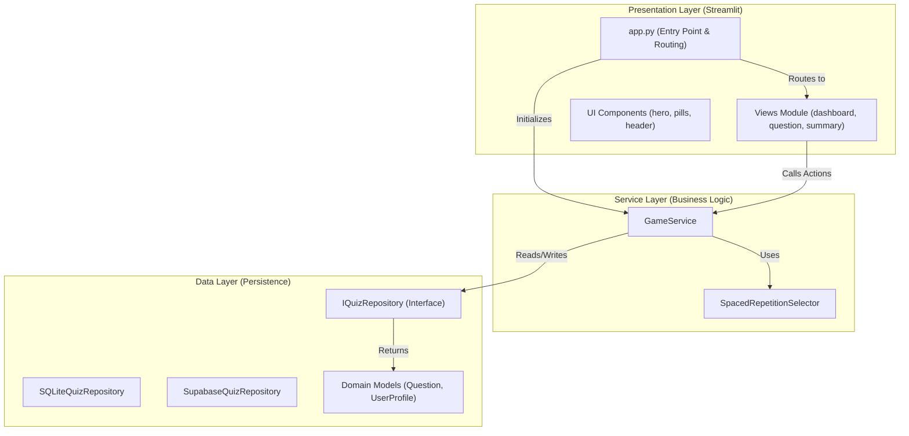
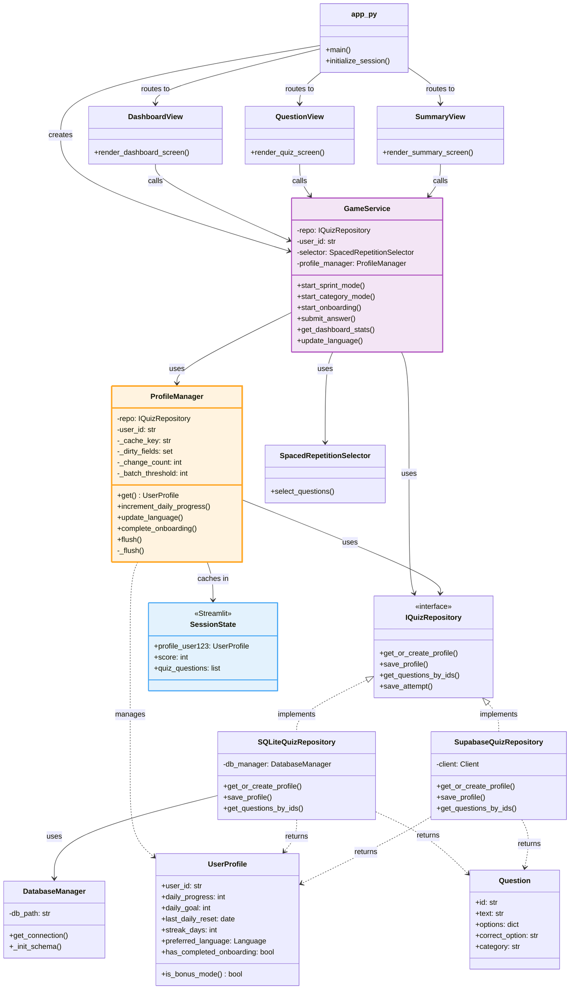

# 1. Architecture & Patterns (The "How")

## 1.1. High-Level Architecture
The application follows a **Streamlit-Native Service Architecture**. It is designed to be flat, explicit, and state-aware, minimizing the abstraction overhead typical of enterprise frameworks while maintaining separation of concerns.

### Diagram


## 1.2. Core Design Patterns

### A. The Service Layer Pattern
*   **Concept:** All business logic (scoring, navigation, database updates) is encapsulated in `GameService`.
*   **Rule:** The UI (Views) **never** talks to the Repository directly. It must go through the Service.
*   **Benefit:** Allows swapping the UI framework (e.g., to FastAPI + React) without rewriting game logic.

### B. The Singleton Service
*   **Concept:** The `GameService` is instantiated **once** in `app.py` and stored in `st.session_state.service`.
*   **Implementation:**
    ```python
    if "service" not in st.session_state:
        repo = SQLiteQuizRepository(...)
        st.session_state.service = GameService(repo)
    ```

### C. State-Based Routing
*   **Concept:** Navigation is controlled by a single string variable: `st.session_state.screen`.
*   **States:**
    *   `"dashboard"`: The main menu.
    *   `"quiz"`: The active question loop.
    *   `"summary"`: The result screen.
*   **Transition:** Views or the Service update this variable, and `st.rerun()` triggers the new view.

### D. Repository Pattern
*   **Concept:** Data access is abstracted behind the `IQuizRepository` interface.
*   **Implementations:**
    *   `SQLiteQuizRepository`: For local development and fast iteration.
    *   `SupabaseQuizRepository`: For production deployment.
*   **Switching:** Controlled via `GameConfig.USE_SQLITE` (or env vars).

#### Known Inconsistencies
⚠️ **Category Mode Behavior:**
- **SQLite:** Prioritizes weakest questions (`ORDER BY consecutive_correct ASC`).
- **Supabase:** Pure random selection (no mastery-based sorting).

**Impact:** Users on Supabase may see random questions instead of their weak spots in Category Mode.

**Recommendation:** Align Supabase implementation with SQLite by adding client-side sorting.

---

## 1.3. State Management Strategy

Streamlit apps are stateless scripts that rerun on every interaction. We manage state in two distinct buckets:

### Bucket 1: Persistent State (Database)
*   **What:** Data that must survive a browser refresh or session close.
*   **Storage:** SQLite / Supabase.
*   **Items:**
    *   `UserProfile` (Language preference, Onboarding status).
    *   `UserProgress` (History of answered questions, Mastery streaks).
*   **Sync Strategy:** **Immediate Write.** Every time a user changes a setting (e.g., Language Pill) or answers a question, we write to the DB immediately.

### Bucket 2: Ephemeral State (Session State)
*   **What:** Data relevant only to the current user session or active quiz flow.
*   **Storage:** `st.session_state`.
*   **Items:**
    *   `quiz_questions`: List of Question objects for the current sprint.
    *   `current_index`: Integer pointer to the active question.
    *   `score`: Current session score.
    *   `feedback_mode`: Boolean flag (Are we showing the question or the result?).
    *   `last_feedback`: Dict containing the result of the last answer (for rendering the feedback view).

---

## 1.4. Service Layer Contract (`GameService`)

The `GameService` is the public API for the application logic.

| Method | Description | Side Effects |
| :--- | :--- | :--- |
| **`get_dashboard_stats(user_id, demo_slug)`** | Calculates progress, mastery, and days left. Handles Demo logo logic. | Reads DB. |
| **`start_daily_sprint(user_id)`** | Selects questions using Spaced Repetition. | Resets Session State. Reruns app. |
| **`start_category_mode(user_id, category)`** | Selects questions from a specific category. | Resets Session State. Reruns app. |
| **`start_onboarding(user_id)`** | Loads the tutorial question. Marks profile as onboarded. | Writes DB. Resets Session State. |
| **`submit_answer(user_id, question, option)`** | Validates answer, updates score, saves attempt to DB. | Writes DB. Updates Session State. |
| **`next_question()`** | Advances index. Checks if quiz is finished. | Updates Session State. May change `screen` to "summary". |
| **`update_language(user_id, lang_code)`** | Updates user preference. | Writes DB. |

---

## 1.5. Directory Structure

```text
/
├── app.py                  # Entry Point & Routing
├── src/
│   ├── config.py           # Configuration & Constants
│   ├── game/
│   │   └── service.py      # CORE LOGIC (The Brain)
│   ├── quiz/
│   │   ├── adapters/       # Database Implementations
│   │   ├── domain/         # Data Models & Algorithms
│   │   └── presentation/   # UI Logic
│   │       └── views/      # Screen Renderers
│   └── components/         # Reusable UI Widgets (HTML/CSS/JS)
└── data/                   # Local SQLite DB & Seed files
```

## 1.6. Demo Mode Strategy
*   **Concept:** A lightweight mechanism to personalize the application for sales prospects without changing the codebase.
*   **Trigger:** URL Query Parameter (e.g., `/?demo=tesla`).
*   **Behavior:**
    1.  **Identity Isolation:** Creates a unique, ephemeral `user_id` (e.g., `demo_tesla`) to prevent polluting real user data.
    2.  **Branding:** Overrides the default application logo with a prospect-specific logo found in `assets/logos/{slug}.png`.
    3.  **Persistence:** The `demo_slug` is stored in `st.session_state` for the duration of the session.

### D. Question Selection
*   **Behavior:** Demo users experience the **same** Smart Mix and Category Mode algorithms as regular users.
*   **Isolation:** Progress is tracked separately (e.g., `demo_tesla` has independent `user_progress` records).
*   **Future Enhancement:** The constant `GameConfig.DEMO_QUESTION_IDS` exists but is **not currently used**. To create a curated demo experience, implement filtering in `GameService.start_daily_sprint()`.
