## 4. Domain Model (Entity Relationships)

This diagram represents the logical data structure derived from `src/quiz/domain/models.py` and the SQLite schema.

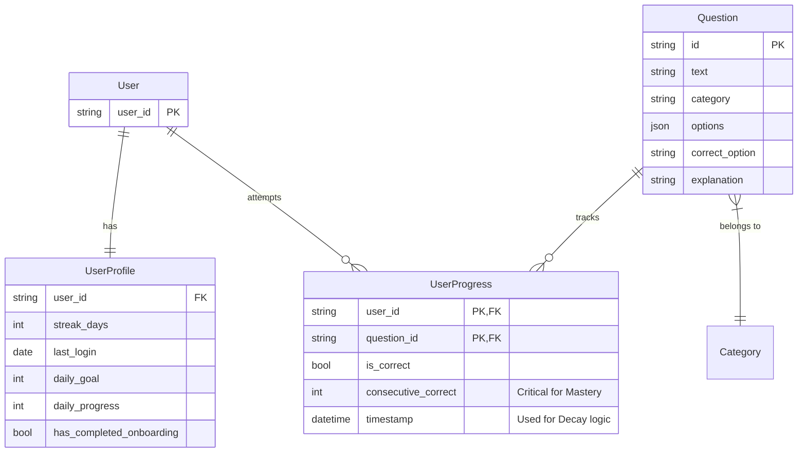

---

## 5. Core Business Processes

### 5.1. The "Smart Mix" Generation Process
This is the most complex logic in the system, residing in `SpacedRepetitionSelector`.

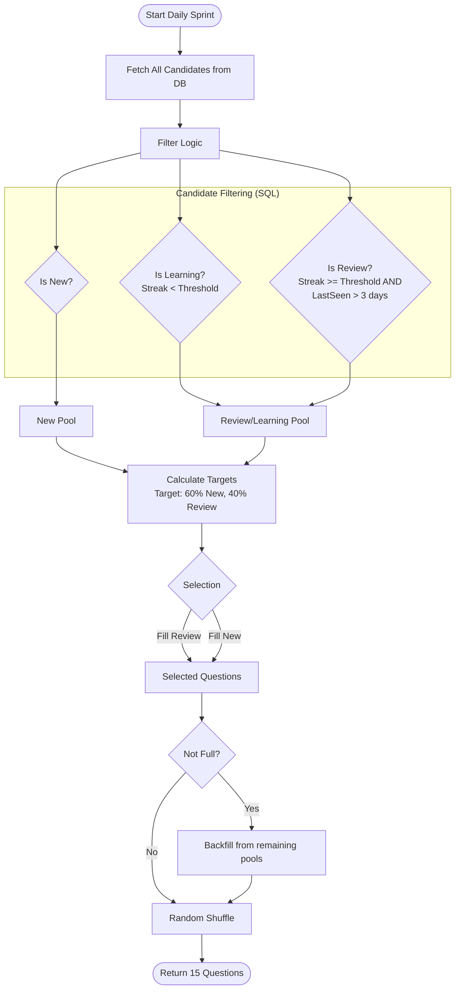

### 5.2. User Attempt & Mastery Update
This process describes what happens when a user clicks an answer button.

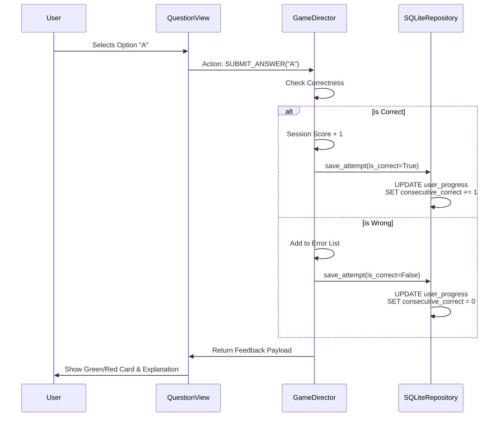

### 5.3. Profile Synchronization (Login)
Logic found in `get_or_create_profile` to handle streaks.

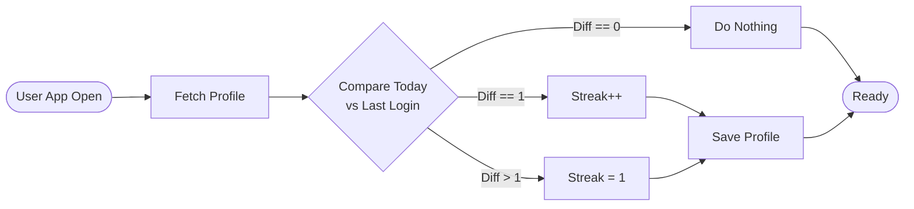

Here is the **Architecture Overview** documentation package.

This document outlines the structural design of the Warehouse Quiz App. It highlights the transition from a standard script-based Streamlit app to a commercial-grade **Hexagonal Architecture** driven by a **State Machine**.

---

## 1. System Architecture Diagram

The system follows a strict **Layered Hexagonal Architecture** (Ports and Adapters). This ensures that the core business logic (Spaced Repetition, Scoring) is completely isolated from the UI framework (Streamlit) and the Database (SQLite).

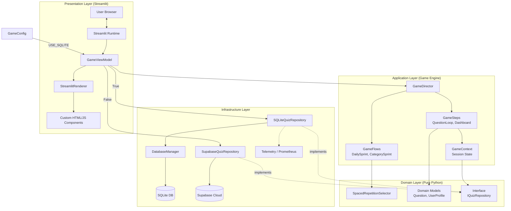

### Gameflow Engine
To visualize this specifically as a Workflow Engine, we can draw it to highlight the "Pipeline" nature of your design.
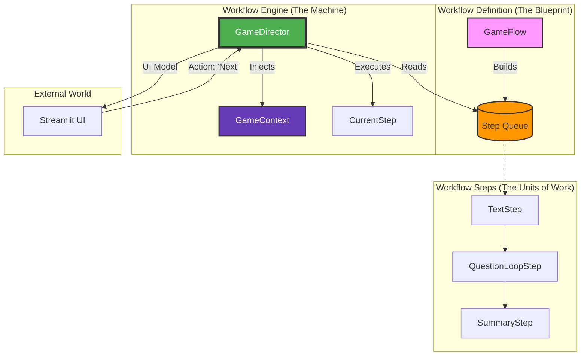

Here are the 4 Mermaid diagrams corresponding to the dimensions we discussed. You can copy these directly into your documentation or a Mermaid live editor.

### 1. The Structural View (The Lego Blocks)
**Focus:** Composition. This shows how a "Flow" is just a container for a list of "Steps", and how specific implementations inherit from the base classes.

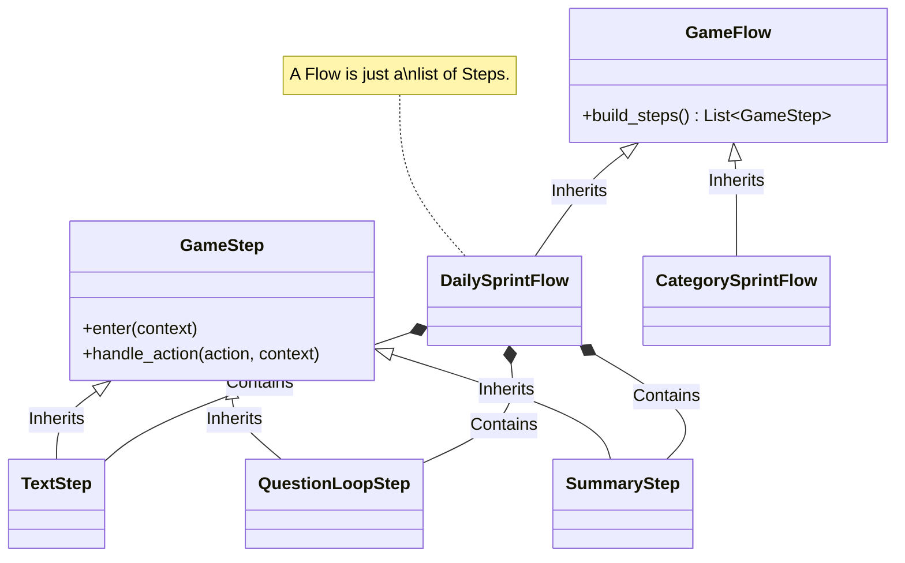

---

### 2. The Temporal View (The Timeline)
**Focus:** The separation between **Building** the machine and **Running** the machine.

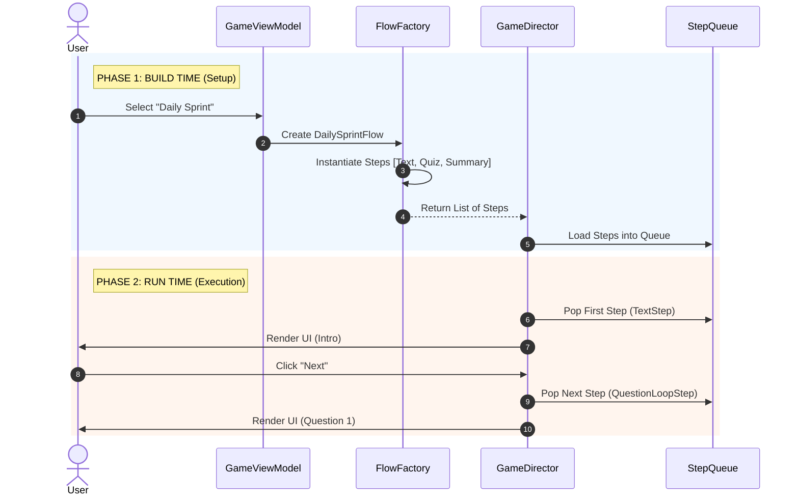

---

### 3. The Data View (The State Flow)
**Focus:** How the `GameContext` (The Backpack) travels through the system and gets modified.

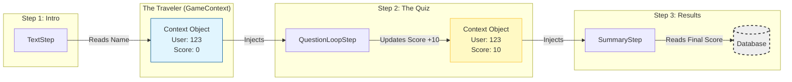

---

### 4. The Control View (The Game Loop)
**Focus:** The logic cycle of the `GameDirector`. This is the "Engine" part.

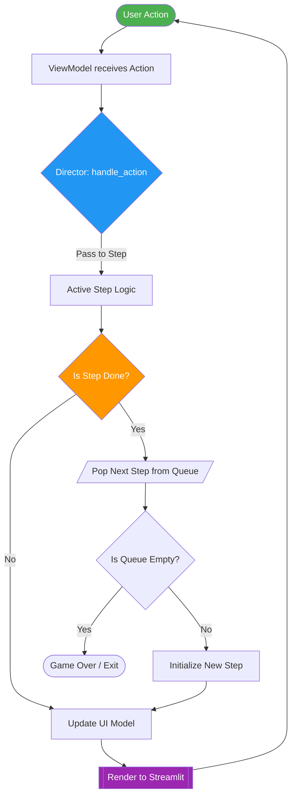

---

## 2. Component Interaction Patterns

### 2.1. The Passive View Pattern
Streamlit reruns the entire script on every interaction. To prevent logic from resetting or becoming "spaghetti code," we use the **Passive View** pattern.
*   **The Renderer (`src/quiz/presentation/renderer.py`)** is "dumb." It contains no logic. It accepts a `UIModel` (DTO) and simply draws widgets.
*   **The Director (`src/game/director.py`)** calculates the state.
*   **Benefit:** We can unit test the game logic without spinning up a browser.

### 2.2. The State Machine (Game Director)
The application behaves as a finite state machine managed by the `GameDirector`.
*   **Flows:** Factories that define a sequence of states (e.g., `DailySprintFlow` creates `[QuestionLoopStep, SummaryStep]`).
*   **Steps:** Individual states that handle user input (`handle_action`) and define output (`get_ui_model`).
*   **Queue:** The Director manages a queue of steps. When a step returns `"NEXT"`, the Director pops the next step from the queue.

### 2.3. Repository Pattern (Ports & Adapters)
The Domain layer defines *what* it needs (`IQuizRepository`), but not *how* to get it.
*   **Port:** `src/quiz/domain/ports.py`
*   **Adapter:** `src/quiz/adapters/sqlite_repository.py`
*   **Benefit:** Allows swapping SQLite for PostgreSQL or a Mock for testing without changing a single line of the Game Engine.

### 2.4. The Demo Mode Pattern (Multi-Tenancy Lite)
To support sales demos without polluting production data or requiring complex auth:
*   **Trigger:** URL Parameter `?demo=slug` (e.g., `?demo=tesla`).
*   **Isolation:** The `GameViewModel` generates a random UUID for the session, ensuring multiple prospects don't overwrite each other's answers.
*   **Tagging:** The `UserProfile` is tagged with metadata `{"type": "demo", "prospect": "tesla"}` for analytics.
*   **Branding:** The `GameContext` carries the prospect slug, allowing the `Renderer` to dynamically inject custom logos into the UI.
*   **Content:** A specialized `DemoFlow` bypasses the spaced repetition algorithm to serve a fixed, curated list of questions defined in `GameConfig`.
---

## 3. Technology Stack Decisions & Rationale

| Component | Technology | Rationale |
| :--- | :--- | :--- |
| **Language** | **Python 3.12+** | Leverages modern typing features (`type | None`, `ParamSpec`) for strict static analysis and performance improvements. |
| **Frontend** | **Streamlit** | Enables rapid development of data-heavy UI. We mitigate its "rerun" limitations using the State Machine architecture. |
| **UI Components** | **HTML/JS/CSS** | Custom `st.components.v2` are used for the Mobile Header and Dashboard to bypass Streamlit's styling limitations and provide a native-app feel. |
| **Database (Dev)** | **SQLite** | Enables offline development and rapid iteration. "Force Seed" mode ensures content updates are visible immediately. |
| **Database (Prod)** | **Supabase (PostgreSQL)** | Provides scalable, cloud-based persistence. Uses `UPSERT` logic to allow safe content patching without downtime. |
| **Observability** | **Prometheus & OpenTelemetry** | "Commercial Grade" requirement. Provides real-time metrics (latency, error rates) and distributed tracing capabilities via `src/shared/telemetry.py`. |
| **Quality Assurance** | **Ruff, Mypy, Pytest** | Strict linting and static type checking ensure the codebase remains maintainable and bug-free as it scales. |

---

## 4. Integration Points

### 4.1. Internal Integration (Persistence)
*   **SQLite File:** The app integrates with the local file system at `data/quiz.db`.
*   **Migration System:** The `DatabaseManager` performs schema checks on startup (`_init_schema`, `_migrate_schema`) to ensure the DB structure matches the code version.

### 4.2. External Integration (Observability)
*   **Prometheus Scraper:** The app exposes metrics (via `prometheus-client`). In a production environment, a Prometheus server would scrape these metrics.
*   **Sentry (Configured):** The `pyproject.toml` includes `sentry-sdk`, indicating integration with Sentry for error tracking and crash reporting.

### 4.3. Future Integration (Authentication)
*   **Current State:** Hardcoded to "User1".
*   **Integration Point:** The `GameContext` initialization in `GameViewModel` is the injection point for an external Identity Provider (OAuth2/OIDC).

---

## 5. Data Flow Diagrams

### 5.1. Rendering Flow (Read Path)
How the system decides what to show the user after a reload.

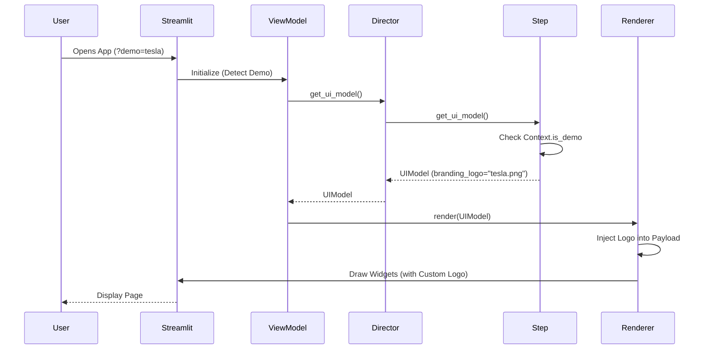

### 5.2. Action Flow (Write Path)
How the system processes a user answer.

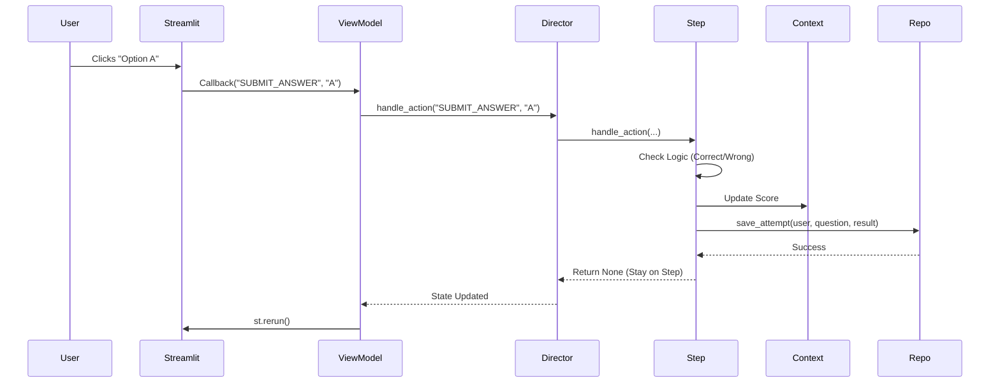
