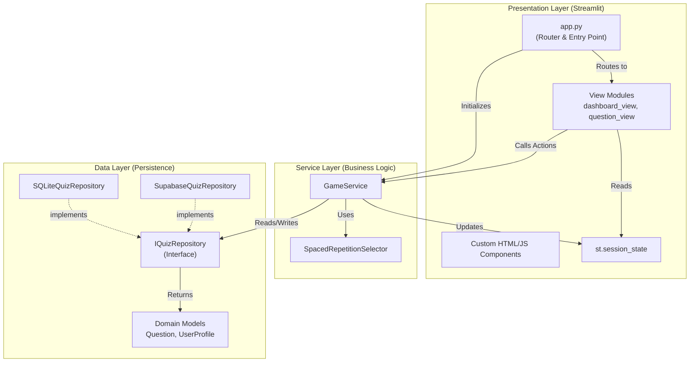
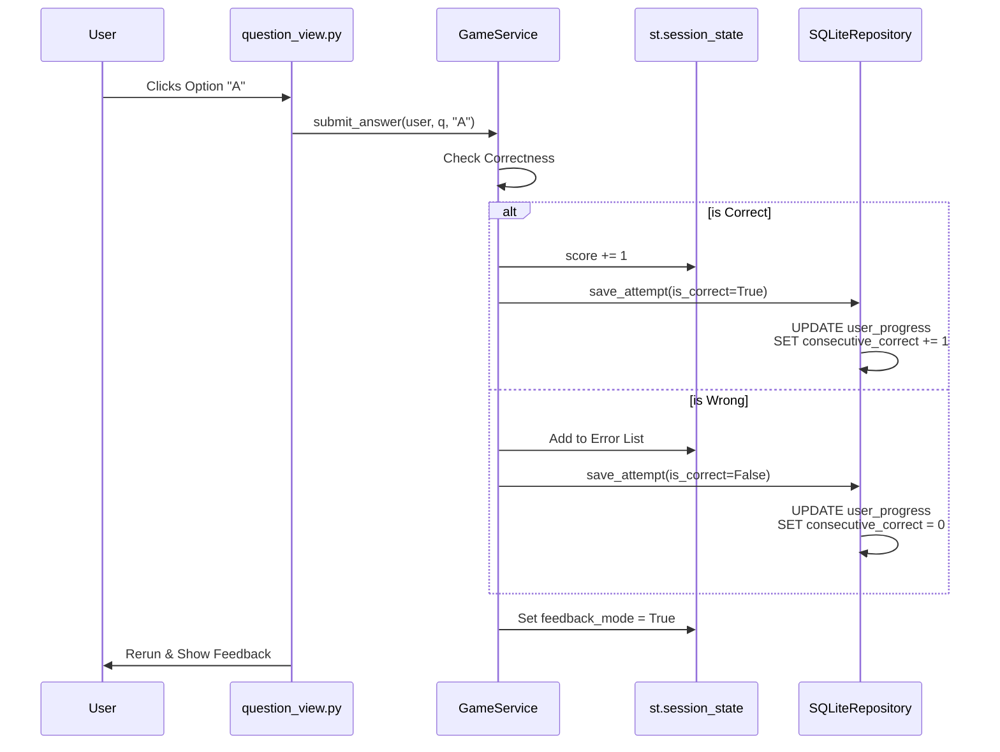
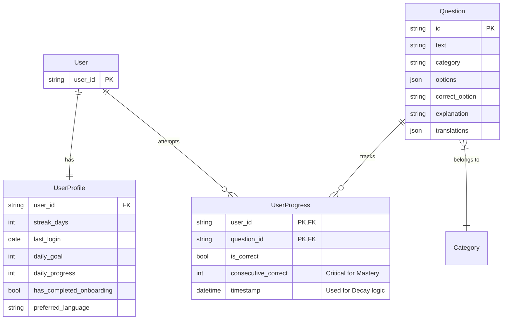

# Architecture Overview

This document outlines the structural design of the Warehouse Quiz App. The application follows a **Service-Oriented Architecture (SOA)** adapted for Streamlit, emphasizing simplicity, direct state management, and a clean separation between UI, Business Logic, and Data.

---

## 1. System Architecture Diagram

The system is divided into three distinct layers. The **Presentation Layer** (Streamlit) interacts directly with the **Service Layer** (Business Logic), which in turn manages the **Data Layer** (Repositories).

---

## 2. Component Interaction Patterns

### 2.1. Streamlit-Native State Management
Instead of a custom "Director" or "Context" object, the application uses Streamlit's native `st.session_state` as the **Single Source of Truth** for transient UI state.
*   **Screen Routing:** `st.session_state.screen` determines which view function to call in `app.py`.
*   **Quiz State:** `st.session_state.quiz_questions`, `current_index`, and `score` track progress.
*   **Service Layer:** The `GameService` is responsible for mutating this state in response to user actions.

### 2.2. Service Layer Pattern
All business logic is encapsulated in `src/game/service.py`.
*   **Responsibility:** It handles rules for scoring, spaced repetition, onboarding, and database synchronization.
*   **Benefit:** The UI (Views) remains "dumb." It simply calls methods like `service.submit_answer()` or `service.start_daily_sprint()`.

### 2.3. Repository Pattern (Ports & Adapters)
The Domain layer defines *what* data operations are needed (`IQuizRepository`), but not *how* they are implemented.
*   **Port:** `src/quiz/domain/ports.py`
*   **Adapter:** `src/quiz/adapters/sqlite_repository.py`
*   **Benefit:** Allows seamless switching between SQLite (local dev) and Supabase (production) via configuration (`GameConfig.USE_SQLITE`).

### 2.4. The Demo Mode Pattern
To support sales demos without polluting production data:
*   **Trigger:** URL Parameter `?demo=slug` (e.g., `?demo=tesla`).
*   **Isolation:** `app.py` detects the parameter and generates a unique `user_id` (e.g., `demo_tesla`), ensuring isolated progress.
*   **Branding:** The `GameService` accepts the slug to dynamically resolve and inject custom logos into the Dashboard.

---

## 3. Core Business Processes

### 3.1. The "Smart Mix" Generation Process
This logic resides in `SpacedRepetitionSelector` and is called by `GameService.start_daily_sprint`.

### 3.2. User Attempt & Mastery Update
This process describes the flow when a user answers a question.

### 3.3. Profile Synchronization (Login)
Logic found in `get_or_create_profile` to handle daily streaks.

---

## 4. Domain Model (Entity Relationships)

This diagram represents the logical data structure derived from `src/quiz/domain/models.py` and the SQLite schema.

---

## 5. Integration Points

### 5.1. Internal Integration (Persistence)
*   **SQLite File:** The app integrates with the local file system at `data/quiz.db`.
*   **Migration System:** The `DatabaseManager` performs schema checks on startup (`_init_schema`, `_migrate_schema`) to ensure the DB structure matches the code version.

### 5.2. External Integration (Observability)
*   **Telemetry:** The `src/shared/telemetry.py` module provides a wrapper for logging and metrics (Prometheus), allowing performance monitoring of database queries and service actions.

### 5.3. Entry Point Integration
*   **`app.py`:** Acts as the Composition Root. It initializes the Repository, seeds the database, creates the `GameService`, and sets up the User Session before routing to the appropriate View.
