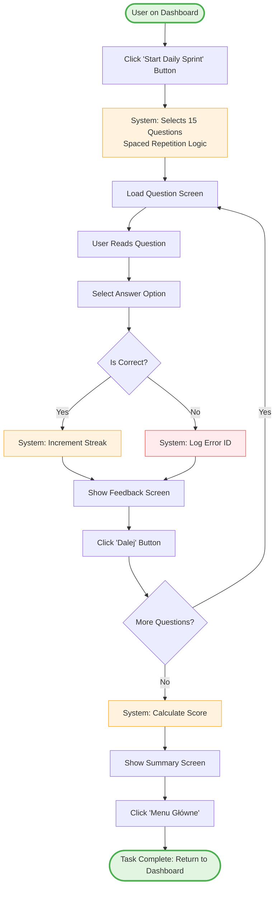
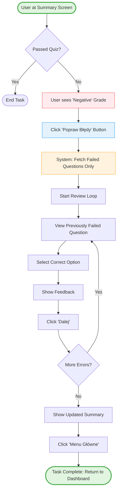
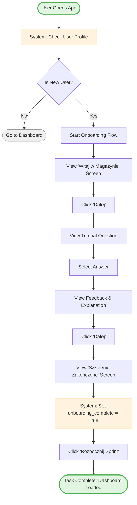
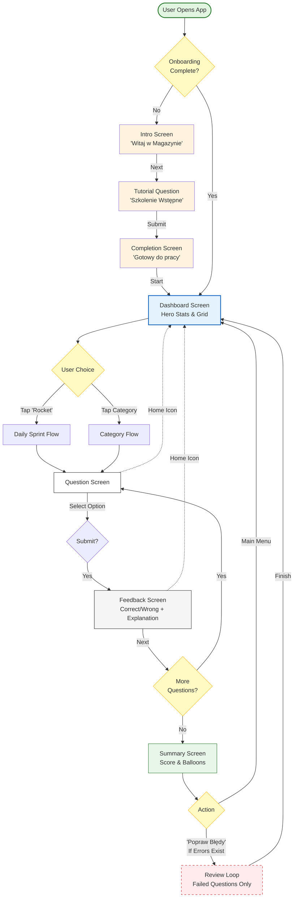
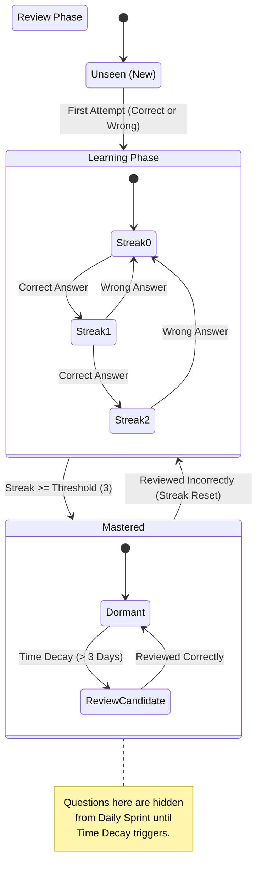

# System Architecture & Design Documentation

## Executive Summary
This document outlines the technical specifications for the **Warehouse Quiz App**, a commercial-grade adaptive learning platform built on **Streamlit**.

Unlike typical Streamlit prototypes, this application utilizes a strict **Hexagonal Architecture (Ports & Adapters)** to decouple business logic from the user interface and database. Key features include:
*   **Adaptive Learning:** A "Spaced Repetition" algorithm that prioritizes questions based on user mastery and time decay.
*   **State Machine Engine:** A robust Director/Flow pattern that manages complex user sessions (Onboarding, Sprints, Reviews) without relying on fragile script execution.
*   **Mobile-First UI:** Custom Shadow DOM components injected into Streamlit to provide a native-app experience on mobile devices.

---

## Project Structure: What is Where?

The codebase is organized by **Architectural Layer** rather than technical function.

### 1. Domain Layer (The "Brain")
*Located in:* `src/quiz/domain/`
*   **Purpose:** Contains pure business logic and entities. Zero dependencies on the UI or Database.
*   **Key Files:**
    *   `models.py`: Defines core entities (`Question`, `UserProfile`).
    *   `ports.py`: Defines interfaces (`IQuizRepository`) that the infrastructure must implement.
    *   `spaced_repetition.py`: The algorithm deciding which questions to show next.

### 2. Application Layer (The "Engine")
*Located in:* `src/game/`
*   **Purpose:** Manages the user session state and screen transitions.
*   **Key Files:**
    *   `director.py`: The central state machine processor.
    *   `flows.py`: Factories that build scenarios (e.g., `DailySprintFlow`, `OnboardingFlow`).
    *   `steps/`: Individual screen logic (e.g., `QuestionLoopStep`, `DashboardStep`).

### 3. Infrastructure Layer (The "Plumbing")
*Located in:* `src/quiz/adapters/`
*   **Purpose:** Implements the Domain interfaces to talk to the outside world (Database).
*   **Key Files:**
    *   `sqlite_repository.py`: The concrete implementation of the database storage.
    *   `db_manager.py`: Handles SQLite connections and migrations in a pickle-safe way.

### 4. Presentation Layer (The "Face")
*Located in:* `src/quiz/presentation/` and `src/components/`
*   **Purpose:** Handles rendering. It is a "Passive View" that only displays what the Engine tells it to.
*   **Key Files:**
    *   `renderer.py`: Maps Engine DTOs to Streamlit widgets.
    *   `src/components/mobile/`: Contains the custom HTML/CSS/JS for the mobile-specific UI (Header, Options, Dashboard Grid).

---
*(Diagrams follow below)*

### Task Flow 1: Complete Daily Sprint
This represents the primary "Happy Path" for a returning user engaging with the Spaced Repetition algorithm.

### Task Flow 2: Review Mistakes
This flow illustrates the specific remediation task triggered when a user fails a quiz. It relies on the logic found in src/game/steps/summary.py.

### Task Flow 3: First-Time Onboarding
This flow represents the initialization task defined in src/game/flows.py (OnboardingFlow) and triggered by src/quiz/presentation/viewmodel.py.

### UI Composition Diagram (The "Face")
Audience: Frontend Developers, UI Designers.
Purpose: Because you are "hacking" Streamlit to look like a mobile app, this diagram is crucial. It maps the Visual Elements to the Code Components. It clearly distinguishes between what is standard Streamlit (Python) and what is Custom Component (HTML/JS/CSS).

```mermaid
graph TD
    subgraph Root["Mobile Screen Layout (Streamlit Page)"]

        subgraph Zone1["Zone 1: Navigation & Context"]
            Header["<b>Custom Component: Mobile Header</b><br/>src/components/mobile/header.py<br/><i>(HTML/JS/CSS Shadow DOM)</i>"]
        end

        subgraph Zone2["Zone 2: Content Area"]
            QText["<b>Native Streamlit: Markdown</b><br/>st.markdown(question.text)"]
            QImage["<b>Native Streamlit: Image</b><br/>st.image(path)"]
        end

        subgraph Zone3["Zone 3: Interaction Area"]
            Options["<b>Custom Component: Mobile Option</b><br/>src/components/mobile/option.py<br/><i>(Repeated for A, B, C, D)</i>"]
        end

        subgraph Zone4["Zone 4: Feedback (Conditional)"]
            Expander["<b>Native Streamlit: Expander</b><br/>st.expander('Hint')"]
            NextBtn["<b>Native Streamlit: Button</b><br/>st.button('Dalej')"]
        end

        Zone1 --> Zone2
        Zone2 --> Zone3
        Zone3 --> Zone4
    end

    %% Styling
    style Root fill:#f9f9f9,stroke:#333,stroke-width:2px
    style Zone1 fill:#e3f2fd,stroke:#2196f3
    style Zone2 fill:#fff3e0,stroke:#ff9800
    style Zone3 fill:#e8f5e9,stroke:#4caf50
    style Zone4 fill:#ffebee,stroke:#f44336

    %% Annotations for Tech Stack
    classDef custom fill:#d1c4e9,stroke:#673ab7,color:black
    classDef native fill:#b2dfdb,stroke:#009688,color:black

    class Header,Options custom
    class QText,QImage,Expander,NextBtn native
```

### Data State Transition Diagram (The "Brain")
Audience: Data Scientists, Backend Developers.
Purpose: This diagram explains the Spaced Repetition Logic found in src/quiz/domain/spaced_repetition.py and src/quiz/adapters/sqlite_repository.py. It visualizes the lifecycle of a single Question entity, which is the core value proposition of your a

