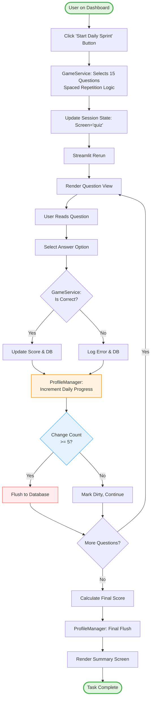
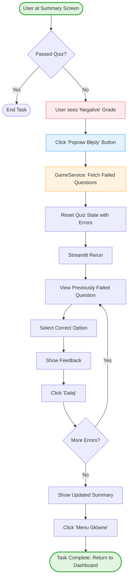
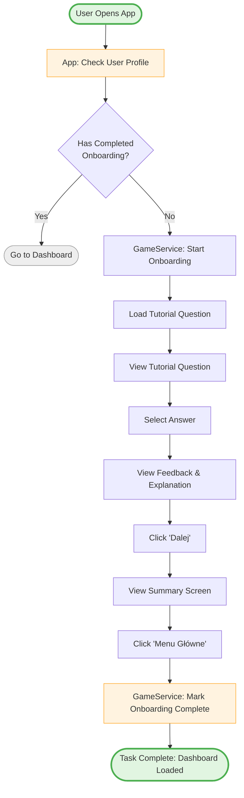
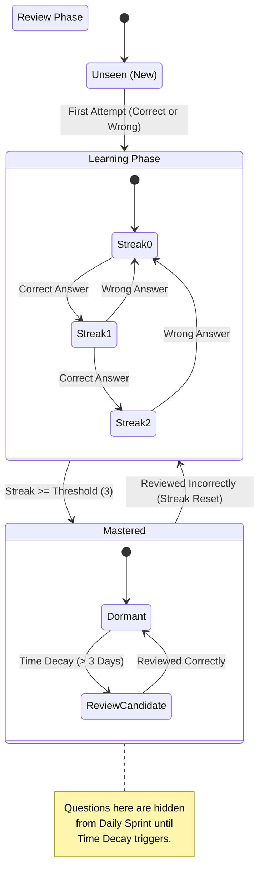

# System Architecture & Design Documentation

## Executive Summary
This document outlines the technical specifications for the **Warehouse Quiz App**, a commercial-grade adaptive learning platform built on **Streamlit**.

The application utilizes a **Service-Oriented Architecture (SOA)** adapted for Streamlit. This approach balances the need for clean separation of concerns with the framework's reactive nature, resulting in a codebase that is easy to maintain and extend. Key features include:
*   **Adaptive Learning:** A "Spaced Repetition" algorithm that prioritizes questions based on user mastery and time decay.
*   **Streamlit-Native State Management:** A simplified architecture that leverages `st.session_state` as the single source of truth, managed by a cohesive Service Layer.
*   **Mobile-First UI:** Custom Shadow DOM components injected into Streamlit to provide a native-app experience on mobile devices.

---

## Project Structure: What is Where?

The codebase is organized into three distinct architectural layers.

### 1. Presentation Layer (The "Face")
*Located in:* `app.py` and `src/quiz/presentation/views/`
*   **Purpose:** Handles rendering, user interaction, and routing. It is "dumb" and delegates all logic to the Service Layer.
*   **Key Files:**
    *   `app.py`: The application entry point and router. Initializes the Service and handles global navigation.
    *   `src/quiz/presentation/views/`: Contains functional views (`dashboard_view.py`, `question_view.py`, `summary_view.py`) that render specific screens.
    *   `src/components/mobile/`: Custom HTML/CSS/JS components for the mobile-specific UI.

### 2. Service Layer (The "Brain")
*Located in:* `src/game/service.py` and `src/quiz/domain/`
*   **Purpose:** Orchestrates business logic, coordinates between repositories and domain models.
*   **Key Files:**
    *   `src/game/service.py`: The main `GameService` class. Handles quiz session lifecycle, scoring, and state transitions.
    *   `src/quiz/domain/spaced_repetition.py`: The algorithm that selects questions based on user mastery.
    *   `src/quiz/domain/profile_manager.py`: **NEW** - Caching layer for `UserProfile` with batched writes to reduce DB load.
    *   `src/quiz/domain/models.py`: Domain entities (`Question`, `UserProfile`, `QuestionCandidate`).

**Key Principle:** The Service Layer is **stateless** (except for `ProfileManager` cache). All persistent state lives in the database or `st.session_state`.

#### ProfileManager: The Caching Layer
*   **Problem Solved:** Streamlit reruns the entire script on every interaction. Without caching, `GameService` would fetch the user profile from the database on every rerun.
*   **Solution:** `ProfileManager` caches the profile in `st.session_state` and batches non-critical writes.
*   **Trade-off:** Slightly more complex code in exchange for ~87% reduction in database calls during a quiz session.
*   **Critical Changes:** Language updates, onboarding completion, and date resets bypass batching and save immediately.

### 3. Data Layer (The "Storage")
*Located in:* `src/quiz/adapters/` and `src/quiz/domain/`
*   **Purpose:** Handles data persistence and domain modeling.
*   **Key Files:**
    *   `sqlite_repository.py`: The concrete implementation for local SQLite storage.
    *   `supabase_repository.py`: The concrete implementation for cloud PostgreSQL storage.
    *   `src/quiz/domain/models.py`: Pydantic models defining `Question`, `UserProfile`, etc.

---

## Task Flows

### Task Flow 1: Complete Daily Sprint
This represents the primary "Happy Path" for a returning user engaging with the Spaced Repetition algorithm.

### Task Flow 2: Review Mistakes
This flow illustrates the specific remediation task triggered when a user fails a quiz.

### Task Flow 3: First-Time Onboarding
This flow represents the initialization task handled by `app.py` and `GameService`.

---

## UI Composition Diagram (The "Face")
This diagram maps the Visual Elements to the Code Components. It clearly distinguishes between standard Streamlit (Python) and Custom Components (HTML/JS/CSS).

```mermaid
graph TD
    subgraph Root["Mobile Screen Layout (Streamlit Page)"]

        subgraph Zone1["Zone 1: Navigation & Context"]
            Header["<b>Custom Component: Mobile Header</b><br/>src/components/mobile/header.py<br/><i>(HTML/JS/CSS Shadow DOM)</i>"]
        end

        subgraph Zone2["Zone 2: Content Area"]
            QText["<b>Native Streamlit: Markdown</b><br/>st.markdown(question.text)"]
            QImage["<b>Native Streamlit: Image</b><br/>st.image(path)"]
        end

        subgraph Zone3["Zone 3: Interaction Area"]
            Options["<b>Custom Component: Mobile Option</b><br/>src/components/mobile/option.py<br/><i>(Repeated for A, B, C, D)</i>"]
        end

        subgraph Zone4["Zone 4: Feedback & Hints"]
            Expander["<b>Native Streamlit: Expander</b><br/>st.expander('Hint')"]
            Pills["<b>Native Streamlit: Pills</b><br/>st.pills('Language')<br/><i>(New Feature)</i>"]
            NextBtn["<b>Native Streamlit: Button</b><br/>st.button('Dalej')"]
        end

        Zone1 --> Zone2
        Zone2 --> Zone3
        Zone3 --> Zone4
    end

    %% Styling
    style Root fill:#f9f9f9,stroke:#333,stroke-width:2px
    style Zone1 fill:#e3f2fd,stroke:#2196f3
    style Zone2 fill:#fff3e0,stroke:#ff9800
    style Zone3 fill:#e8f5e9,stroke:#4caf50
    style Zone4 fill:#ffebee,stroke:#f44336

    %% Annotations for Tech Stack
    classDef custom fill:#d1c4e9,stroke:#673ab7,color:black
    classDef native fill:#b2dfdb,stroke:#009688,color:black

    class Header,Options custom
    class QText,QImage,Expander,Pills,NextBtn native
```

---

## Data State Transition Diagram (The "Brain")
This diagram explains the Spaced Repetition Logic found in `src/quiz/domain/spaced_repetition.py`. It visualizes the lifecycle of a single Question entity.

