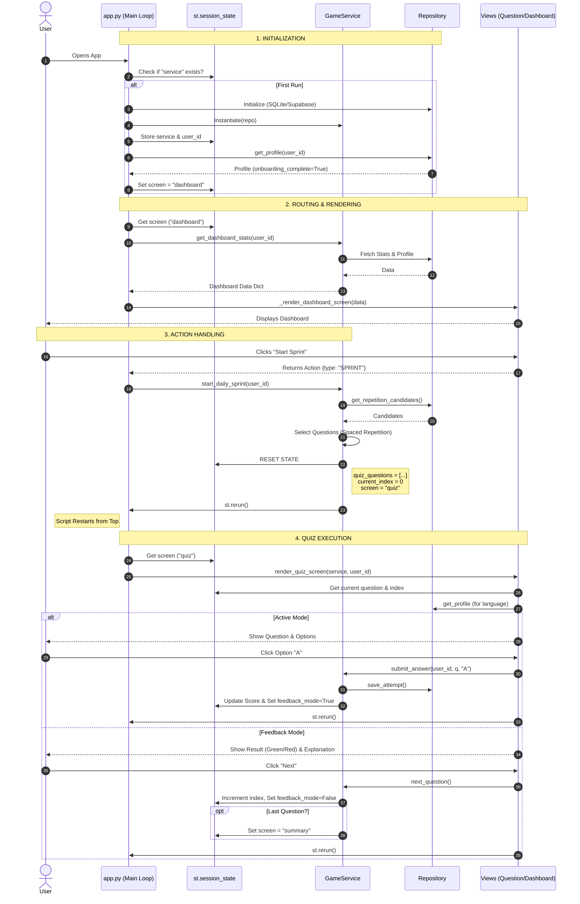

```mermaid
sequenceDiagram
    autonumber
    actor User
    participant App as app.py (Main Loop)
    participant Session as st.session_state
    participant Service as GameService
    participant Repo as Repository
    participant View as Views (Question/Dashboard)

    %% --- SCENARIO 1: STARTUP ---
    Note over App, Repo: 1. INITIALIZATION
    User->>App: Opens App
    App->>Session: Check if "service" exists?
    alt First Run
        App->>Repo: Initialize (SQLite/Supabase)
        App->>Service: Instantiate(repo)
        App->>Session: Store service & user_id
        App->>Repo: get_profile(user_id)
        Repo-->>App: Profile (onboarding_complete=True)
        App->>Session: Set screen = "dashboard"
    end

    %% --- SCENARIO 2: DASHBOARD RENDER ---
    Note over App, View: 2. ROUTING & RENDERING
    App->>Session: Get screen ("dashboard")
    App->>Service: get_dashboard_stats(user_id)
    Service->>Repo: Fetch Stats & Profile
    Repo-->>Service: Data
    Service-->>App: Dashboard Data Dict

    App->>View: _render_dashboard_screen(data)
    View-->>User: Displays Dashboard

    %% --- SCENARIO 3: STARTING A QUIZ ---
    Note over User, Service: 3. ACTION HANDLING
    User->>View: Clicks "Start Sprint"
    View-->>App: Returns Action {type: "SPRINT"}

    App->>Service: start_daily_sprint(user_id)
    Service->>Repo: get_repetition_candidates()
    Repo-->>Service: Candidates
    Service->>Service: Select Questions (Spaced Repetition)

    Service->>Session: RESET STATE
    Note right of Service: quiz_questions = [...]<br/>current_index = 0<br/>screen = "quiz"

    Service->>App: st.rerun()
    Note left of App: Script Restarts from Top

    %% --- SCENARIO 4: QUIZ LOOP ---
    Note over App, View: 4. QUIZ EXECUTION
    App->>Session: Get screen ("quiz")
    App->>View: render_quiz_screen(service, user_id)

    View->>Session: Get current question & index
    View->>Repo: get_profile (for language)

    alt Active Mode
        View-->>User: Show Question & Options
        User->>View: Click Option "A"
        View->>Service: submit_answer(user_id, q, "A")
        Service->>Repo: save_attempt()
        Service->>Session: Update Score & Set feedback_mode=True
        View->>App: st.rerun()
    else Feedback Mode
        View-->>User: Show Result (Green/Red) & Explanation
        User->>View: Click "Next"
        View->>Service: next_question()
        Service->>Session: Increment index, Set feedback_mode=False

        opt Last Question?
            Service->>Session: Set screen = "summary"
        end

        View->>App: st.rerun()
    end
```
