Hexagonal Architecture (Ports & Adapters)
The "Clean Code" Choice.
This is what we used in your Quiz App refactoring. It isolates the business logic from the outside world.
Structure:
Core (Inside): Pure business logic (Entities, Use Cases).
Ports: Interfaces defining how data gets in/out.
Adapters (Outside): Implementations (SQL, REST API, CLI, Streamlit).
The Rule: Dependencies always point inward. The Core knows nothing about the Database or the Web.
Best For:
Long-lived applications (5+ years) where technology might change.
Complex business domains (Banking, Insurance, Logistics).
High testability requirements (testing core logic without a DB).
Warning: Overkill for simple CRUD apps. Requires writing a lot of interfaces/DTOs.

---

Here is a commercial-grade visualization of **Hexagonal Architecture (Ports & Adapters)**.

I have chosen the **Payment Processing Domain** as the example. This is the perfect candidate for Hexagonal Architecture because the core logic (fraud detection, transaction rules) must remain stable, while the external tools (Stripe, PayPal, SQL, Mongo, Email) change frequently.

### The Core Rules of Hexagonal
1.  **Dependency Rule:** Dependencies point **inward**. The Core knows *nothing* about the database or the web API.
2.  **Ports (Interfaces):** The Core defines *how* it wants to talk to the outside world.
3.  **Adapters (Implementations):** The outside world implements those interfaces to plug into the Core.

---

### 1. Architecture Diagram (Mermaid)

Notice the clear boundary (the Hexagon) around the Application Core.

```mermaid
classDiagram
    %% ============================================================
    %% THE HEXAGON (Application Core)
    %% Pure Business Logic. No SQL, No HTTP, No Frameworks.
    %% ============================================================
    namespace Core_Domain {
        class Payment {
            +UUID id
            +Money amount
            +Status status
            +process()
            +refund()
        }
        
        class FraudChecker {
            +validate(payment)
        }
    }

    namespace Core_Ports {
        %% DRIVING PORT (Inbound) - How the world talks to us
        class IPaymentUseCase {
            <<Interface>>
            +process_payment(cmd: ProcessPaymentCommand)
        }

        %% DRIVEN PORTS (Outbound) - How we talk to the world
        class IPaymentRepository {
            <<Interface>>
            +save(payment)
            +find_by_id(id)
        }
        
        class IBankGateway {
            <<Interface>>
            +charge_credit_card(token, amount)
        }
        
        class INotificationService {
            <<Interface>>
            +send_receipt(email, amount)
        }
    }

    namespace Core_Application {
        class PaymentService {
            -IPaymentRepository repo
            -IBankGateway bank
            -INotificationService notifier
            +process_payment(cmd)
        }
    }

    %% ============================================================
    %% ADAPTERS (Infrastructure)
    %% The dirty details. These depend on the Core.
    %% ============================================================
    namespace Adapters_Primary {
        class REST_Controller {
            +post_payment()
        }
        class CLI_Command {
            +run_batch()
        }
    }

    namespace Adapters_Secondary {
        class PostgresRepository {
            +save()
            +find_by_id()
        }
        class StripeAdapter {
            +charge_credit_card()
        }
        class SmtpEmailAdapter {
            +send_receipt()
        }
    }

    %% ============================================================
    %% RELATIONSHIPS (Pointing Inward)
    %% ============================================================
    
    %% Realization (Adapters implement Ports)
    PaymentService ..|> IPaymentUseCase
    PostgresRepository ..|> IPaymentRepository
    StripeAdapter ..|> IBankGateway
    SmtpEmailAdapter ..|> INotificationService

    %% Dependency Injection (Core uses Ports)
    PaymentService --> IPaymentRepository
    PaymentService --> IBankGateway
    PaymentService --> INotificationService
    PaymentService --> Payment : Manipulates

    %% Primary Adapters call the Use Case
    REST_Controller --> IPaymentUseCase
    CLI_Command --> IPaymentUseCase
```



---

### 2. Core API Contracts (Python Pseudo-code)

Notice how the **Core** folder has zero imports from libraries like `flask`, `sqlalchemy`, or `stripe`.

#### The Core (Ports & Use Cases)
*File: `src/core/ports.py`*
```python
from abc import ABC, abstractmethod
from dataclasses import dataclass

# --- The Driving Port (API for the UI) ---
@dataclass
class ProcessPaymentCommand:
    user_id: str
    amount: float
    currency: str
    card_token: str

class IPaymentUseCase(ABC):
    @abstractmethod
    def process_payment(self, cmd: ProcessPaymentCommand):
        pass

# --- The Driven Ports (SPI for Infrastructure) ---
class IPaymentRepository(ABC):
    @abstractmethod
    def save(self, payment): pass

class IBankGateway(ABC):
    @abstractmethod
    def charge_credit_card(self, token: str, amount: float) -> str:
        """Returns transaction ID or raises BankException"""
        pass
```

#### The Core (Application Logic)
*File: `src/core/service.py`*
```python
class PaymentService(IPaymentUseCase):
    def __init__(self, repo: IPaymentRepository, bank: IBankGateway):
        self.repo = repo
        self.bank = bank

    def process_payment(self, cmd: ProcessPaymentCommand):
        # 1. Domain Logic
        if cmd.amount > 10000:
            raise FraudException("Amount too high")

        # 2. Call External System (via Interface)
        try:
            # We don't know if this is Stripe, PayPal, or a Mock
            txn_id = self.bank.charge_credit_card(cmd.card_token, cmd.amount)
            status = "SUCCESS"
        except BankException:
            txn_id = None
            status = "FAILED"

        # 3. Persist State (via Interface)
        payment = Payment(user_id=cmd.user_id, amount=cmd.amount, status=status, txn_id=txn_id)
        self.repo.save(payment)
```

#### The Adapters (Infrastructure)
*File: `src/adapters/stripe_adapter.py`*
```python
import stripe  # External library is ISOLATED here

class StripeAdapter(IBankGateway):
    def charge_credit_card(self, token: str, amount: float) -> str:
        try:
            charge = stripe.Charge.create(amount=int(amount*100), source=token)
            return charge.id
        except stripe.error.CardError:
            raise BankException("Card declined")
```

*File: `src/adapters/api_controller.py`*
```python
from flask import Flask, request
# Import the Interface, not the implementation (if using DI container)
from src.core.ports import ProcessPaymentCommand

app = Flask(__name__)

# Injected via Dependency Injection container
payment_service = ... 

@app.route("/pay", methods=["POST"])
def pay():
    data = request.json
    cmd = ProcessPaymentCommand(**data)
    
    # The Controller translates HTTP to Domain Command
    payment_service.process_payment(cmd)
    
    return {"status": "accepted"}, 202
```

### Why use this pattern?
1.  **Testability:** You can test `PaymentService` by passing a `MockBankGateway`. You can run your entire core business logic test suite in milliseconds without hitting Stripe's API.
2.  **Flexibility:** If Stripe raises their fees, you can write a `PayPalAdapter`, change one line in your dependency injection config, and the entire Core application switches over instantly.
3.  **Stability:** Changes in the database schema or API libraries do not break your business rules.