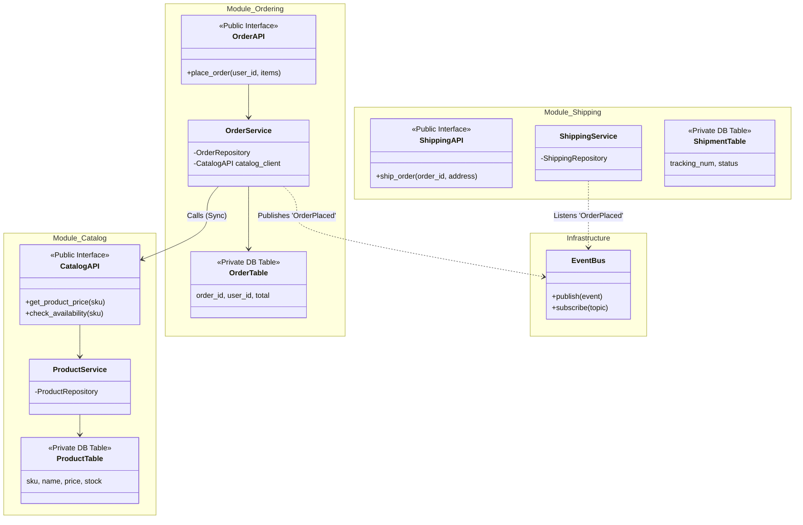

### 3. Modular Monolith
**The "Smart Startup" Choice.**
This is the modern alternative to Microservices. You build *one* deployable unit, but inside, the code is strictly separated by **Business Domain** (not technical layers).

*   **Structure:**
    *   `Module: Billing` (Has its own UI, Service, DB Tables).
    *   `Module: Inventory` (Has its own UI, Service, DB Tables).
    *   `Module: Users` (Has its own UI, Service, DB Tables).
*   **The Rule:** Modules talk to each other via public APIs (function calls), but cannot touch each other's private tables.
*   **Best For:**
    *   Startups scaling up.
    *   Teams of 5-20 developers.
    *   Systems that *might* need microservices later, but not yet.
*   **Warning:** Requires discipline. It's easy to accidentally couple modules if you aren't strict with imports.

---

Here is a commercial-grade visualization of a **Modular Monolith**.

I have chosen the **E-Commerce Domain** as the example. This is the classic use case: you have distinct business areas (Catalog, Cart, Ordering, Shipping) that need to be separate but still live in the same codebase for ease of deployment.

### The Core Rules of Modular Monolith
1.  **Module Isolation:** Each module (e.g., `Inventory`) has its own internal architecture (Layered or Hexagonal).
2.  **Public API:** Modules cannot import each other's internal classes. They can only talk via a defined **Public Interface**.
3.  **Data Sovereignty:** The `Order` module **cannot** write a SQL JOIN on the `Product` table. It must ask the `Inventory` module for data via the API.

---

### 1. Architecture Diagram (Mermaid)

Notice how the database is logically split (even if physically one DB), and modules communicate via "Public Contracts."



---

### 2. Core API Contracts (Python Pseudo-code)

In a Modular Monolith, folder structure is everything.

#### Directory Structure
```text
src/
  modules/
    catalog/
      __init__.py       <-- Exposes Public API
      api.py            <-- The Contract
      internal/         <-- Private Implementation
        service.py
        repository.py
        models.py
    ordering/
      __init__.py
      api.py
      internal/
        service.py
```

#### Module 1: Catalog (The Provider)
*File: `src/modules/catalog/api.py`*
```python
# The Public Contract. Other modules import THIS file only.
from dataclasses import dataclass

@dataclass
class ProductDTO:
    sku: str
    price: float
    in_stock: bool

class CatalogModule:
    def get_product(self, sku: str) -> ProductDTO:
        """
        Public entry point.
        Delegates to internal service.
        """
        from .internal.service import ProductService
        return ProductService().get_by_sku(sku)
```

#### Module 2: Ordering (The Consumer)
*File: `src/modules/ordering/internal/service.py`*
```python
# Notice: We import the Catalog MODULE, not the Catalog Service/Model directly.
from src.modules.catalog.api import CatalogModule

class OrderService:
    def __init__(self, catalog: CatalogModule):
        self.catalog = catalog

    def create_order(self, user_id: str, sku: str):
        # 1. Cross-Module Call
        # We ask the Catalog module for data. We do NOT query the 'products' table.
        product = self.catalog.get_product(sku)

        if not product.in_stock:
            raise Exception("Out of stock")

        # 2. Local Logic
        order = Order(user_id=user_id, amount=product.price)
        self.repo.save(order)

        # 3. Publish Event (Decoupled Communication)
        EventBus.publish("OrderPlaced", {"order_id": order.id})
```

### Why use this pattern?
1.  **Refactoring Safety:** You can rewrite the entire internal logic of the `Catalog` module (e.g., change DB schema) without breaking the `Ordering` module, as long as `CatalogAPI` stays the same.
2.  **Cognitive Load:** A developer working on `Shipping` doesn't need to understand `Ordering` code. They just look at the API.
3.  **Pre-Microservices:** If the `Catalog` module becomes too heavy, you can easily rip it out into a separate Microservice because the boundaries are already strictly defined.