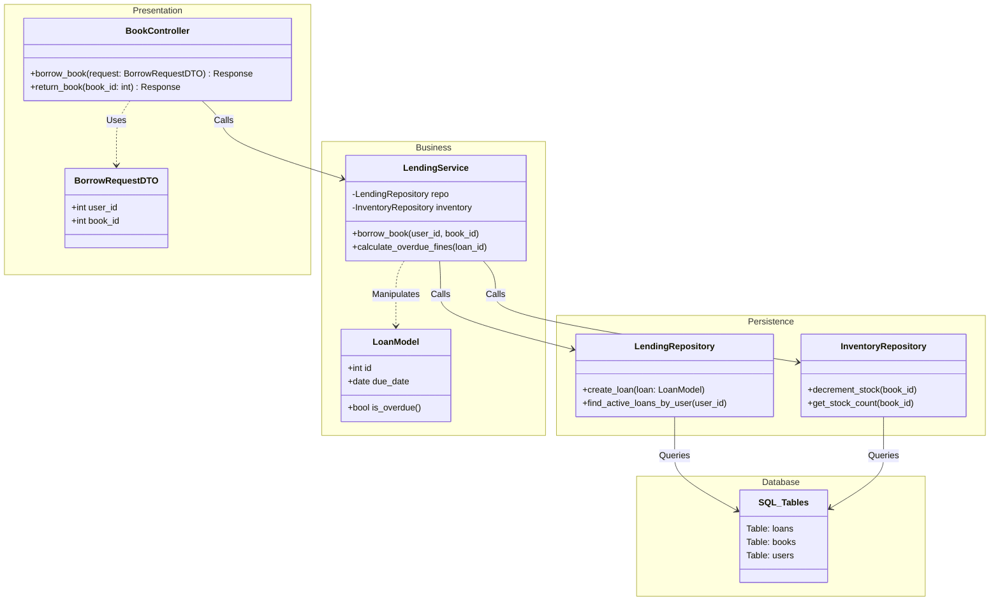

In the commercial software industry, we don't just pick an architecture because it's trendy. We pick it based on **Scale**, **Complexity**, and **Team Structure**.

Here are the **Big 5 Core Architectures** used in production today, ranging from simple to massive.

---

### 1. Layered Architecture (N-Tier)
**The "Standard Standard".**
This is the default for 80% of enterprise applications. It organizes code horizontally by technical concern.

*   **Structure:** Presentation Layer (UI) $\rightarrow$ Business Layer (Service) $\rightarrow$ Persistence Layer (DAO/Repo) $\rightarrow$ Database.
*   **The Rule:** Layers can only talk to the layer directly below them.
*   **Best For:**
    *   Standard CRUD applications (e-commerce, internal tools).
    *   Teams where developers specialize (e.g., "Frontend Guy", "Backend Guy", "DBA").
    *   **Example:** A standard Django or Spring Boot app.
*   **Warning:** Can lead to "Sinkhole Anti-pattern" where requests just pass through layers without doing anything useful.

---

Here is a commercial-grade visualization of a **Layered Architecture (N-Tier)**.

I have chosen the **Library Management Domain** as the example. It is complex enough to show the flow (borrowing, returning, fines) but simple enough to understand the layers clearly.

### The Core Rules of N-Tier
1.  **Strict Layering:** The *Presentation* layer can only talk to *Business*. *Business* can only talk to *Persistence*.
2.  **Dependency Flow:** Dependencies point **downwards**. The Database layer knows nothing about the UI.
3.  **Isolation:** You can swap the UI (e.g., from Web to Mobile) without touching the Business Logic.

---

### 1. Architecture Diagram (Mermaid)

This diagram visualizes the flow of a "Borrow Book" request.



---

### 2. Core API Contracts (Python Pseudo-code)

Here is how the code looks in a commercial N-Tier project. Notice how "dumb" the Controller is and how "smart" the Service is.

#### Layer 1: Presentation (Controller)
*File: `src/controllers/book_controller.py`*
```python
class BookController:
    def __init__(self, service: LendingService):
        self.service = service

    def borrow_book(self, request: dict):
        """
        1. Validate Input (Is user_id an int?)
        2. Call Service
        3. Handle Errors (Convert Exceptions to HTTP 400/500)
        """
        try:
            dto = BorrowRequestDTO(**request)
            loan = self.service.borrow_book(dto.user_id, dto.book_id)
            return {"status": 200, "loan_id": loan.id, "due_date": loan.due_date}
        except OutOfStockException:
            return {"status": 409, "error": "Book not available"}
        except UserBlockedException:
            return {"status": 403, "error": "User has unpaid fines"}
```

#### Layer 2: Business Logic (Service)
*File: `src/services/lending_service.py`*
```python
class LendingService:
    def __init__(self, lending_repo, inventory_repo):
        self.lending_repo = lending_repo
        self.inventory_repo = inventory_repo

    def borrow_book(self, user_id: int, book_id: int) -> LoanModel:
        """
        The Brains. Orchestrates the transaction.
        """
        # 1. Business Rule: Check Inventory
        stock = self.inventory_repo.get_stock_count(book_id)
        if stock <= 0:
            raise OutOfStockException()

        # 2. Business Rule: Check User Standing
        active_loans = self.lending_repo.find_active_loans_by_user(user_id)
        if len(active_loans) >= 5:
            raise LoanLimitExceededException("Max 5 books allowed")

        # 3. Perform Action (Atomic Transaction)
        loan = LoanModel(user_id=user_id, book_id=book_id, due_date=date.today() + days(14))
        
        self.inventory_repo.decrement_stock(book_id)
        self.lending_repo.create_loan(loan)
        
        return loan
```

#### Layer 3: Persistence (Repository)
*File: `src/repositories/lending_repository.py`*
```python
class LendingRepository:
    def __init__(self, db_connection):
        self.conn = db_connection

    def create_loan(self, loan: LoanModel):
        """
        Dumb Data Access. Just SQL.
        """
        sql = "INSERT INTO loans (user_id, book_id, due_date) VALUES (?, ?, ?)"
        self.conn.execute(sql, (loan.user_id, loan.book_id, loan.due_date))
```

### Why use this pattern?
If you decide tomorrow to switch from **SQL** to **MongoDB**, you only rewrite **Layer 3 (Persistence)**. The Business Logic (Layer 2) and the API (Layer 1) remain exactly the same. This is the power of layering.