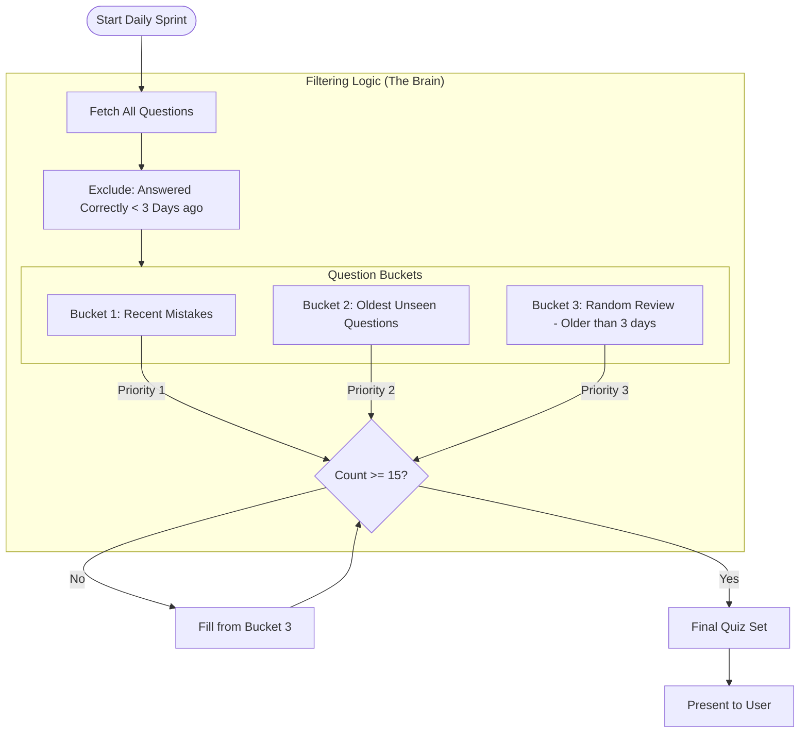
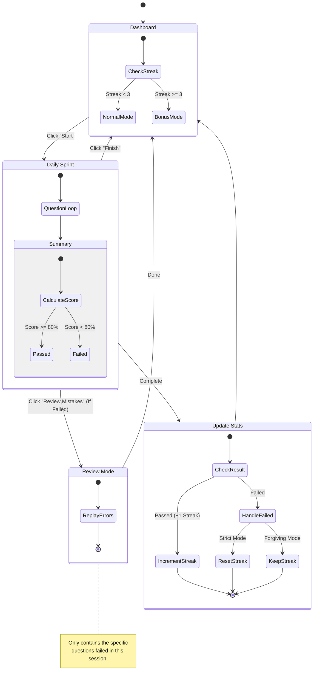
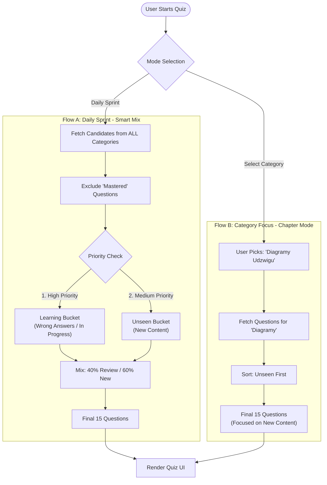
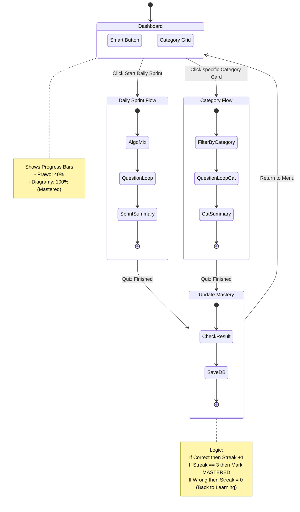
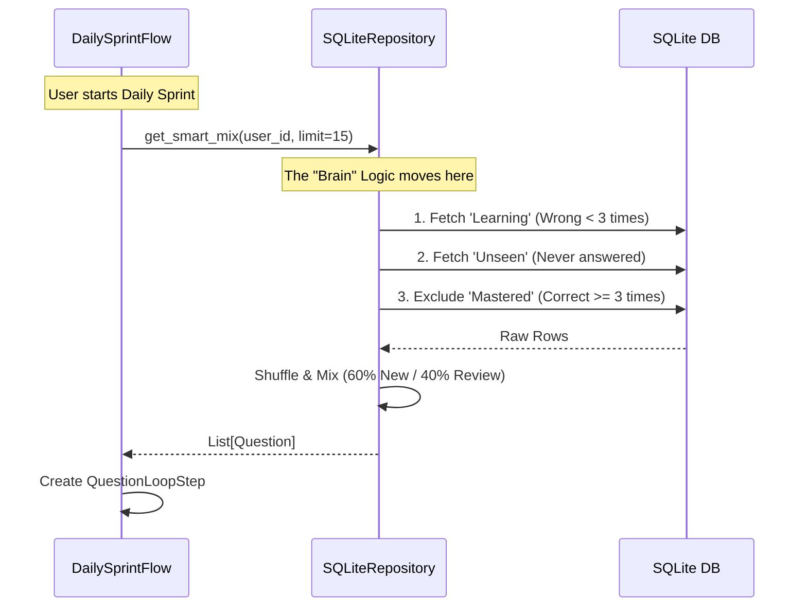

```mermaid
flowchart TD
    Start([Start Daily Sprint]) --> Fetch[Fetch All Questions]

    subgraph Brain["Filtering Logic (The Brain)"]
        Fetch --> Exclude[Exclude: Answered Correctly < 3 Days ago]
        Exclude --> Buckets

        subgraph Buckets[Question Buckets]
            direction TB
            B1[Bucket 1: Recent Mistakes]
            B2[Bucket 2: Oldest Unseen Questions]
            B3[Bucket 3: Random Review - Older than 3 days]
        end

        B1 -- Priority 1 --> Selection
        B2 -- Priority 2 --> Selection
        B3 -- Priority 3 --> Selection
    end

    Selection{Count >= 15?}
    Selection -- No --> Fill[Fill from Bucket 3]
    Fill --> Selection
    Selection -- Yes --> Final[Final Quiz Set]

    Final --> User[Present to User]
```

```mermaid
stateDiagram-v2
    [*] --> Dash

    state "Dashboard" as Dash {
        [*] --> CheckStreak
        CheckStreak --> NormalMode : Streak < 3
        CheckStreak --> BonusMode : Streak >= 3
    }

    Dash --> Sprint : Click "Start"

    state "Daily Sprint" as Sprint {
        [*] --> QuestionLoop
        QuestionLoop --> Summary

        state "Summary" as Summary {
            [*] --> CalculateScore
            CalculateScore --> Passed : Score >= 80%
            CalculateScore --> Failed : Score < 80%
        }
    }

    Sprint --> Review : Click "Review Mistakes" (If Failed)
    Sprint --> Dash : Click "Finish"

    state "Review Mode" as Review {
        [*] --> ReplayErrors
        ReplayErrors --> [*]
    }

    note right of Review
        Only contains the specific
        questions failed in this session.
    end note

    Review --> Dash : Done

    Sprint --> UpdateStats : Complete

    state "Update Stats" as UpdateStats {
        [*] --> CheckResult
        CheckResult --> IncrementStreak : Passed (+1 Streak)
        CheckResult --> HandleFailed : Failed
        HandleFailed --> ResetStreak : Strict Mode
        HandleFailed --> KeepStreak : Forgiving Mode
        IncrementStreak --> [*]
        ResetStreak --> [*]
        KeepStreak --> [*]
    }

    UpdateStats --> Dash
```

```mermaid
flowchart TD
    Start([User Starts Quiz]) --> Choice{Mode Selection}

    subgraph FlowA["Flow A: Daily Sprint - Smart Mix"]
        FetchAll[Fetch Candidates from ALL Categories]
        FetchAll --> FilterMastered["Exclude 'Mastered' Questions"]
        FilterMastered --> Priority{Priority Check}

        Priority -- "1. High Priority" --> BucketLearning["Learning Bucket<br/>(Wrong Answers / In Progress)"]
        Priority -- "2. Medium Priority" --> BucketUnseen["Unseen Bucket<br/>(New Content)"]

        BucketLearning --> Mix["Mix: 40% Review / 60% New"]
        BucketUnseen --> Mix
        Mix --> FinalSprint[Final 15 Questions]
    end

    subgraph FlowB["Flow B: Category Focus - Chapter Mode"]
        UserPick["User Picks: 'Diagramy Udzwigu'"]
        UserPick --> FetchCat["Fetch Questions for 'Diagramy'"]
        FetchCat --> Sort[Sort: Unseen First]
        Sort --> FinalCat["Final 15 Questions<br/>(Focused on New Content)"]
    end

    Choice -- "Daily Sprint" --> FetchAll
    Choice -- "Select Category" --> UserPick

    FinalSprint --> QuizUI[Render Quiz UI]
    FinalCat --> QuizUI
```

```mermaid
stateDiagram-v2
    [*] --> Dashboard

    state "Dashboard" as Dashboard {
        Smart : Smart Button
        Grid : Category Grid
    }

    note right of Dashboard
        Shows Progress Bars
        - Prawo: 40%
        - Diagramy: 100% (Mastered)
    end note

    Dashboard --> DailySprintFlow : Click Start Daily Sprint
    Dashboard --> CategoryFlow : Click specific Category Card

    state "Daily Sprint Flow" as DailySprintFlow {
        [*] --> AlgoMix
        AlgoMix --> QuestionLoop
        QuestionLoop --> SprintSummary
        SprintSummary --> [*]
    }

    state "Category Flow" as CategoryFlow {
        [*] --> FilterByCategory
        FilterByCategory --> QuestionLoopCat
        QuestionLoopCat --> CatSummary
        CatSummary --> [*]
    }

    DailySprintFlow --> UpdateMastery : Quiz Finished
    CategoryFlow --> UpdateMastery : Quiz Finished

    state "Update Mastery" as UpdateMastery {
        [*] --> CheckResult
        CheckResult --> SaveDB
        SaveDB --> [*]
    }

    note right of UpdateMastery
        Logic:
        If Correct then Streak +1
        If Streak == 3 then Mark MASTERED
        If Wrong then Streak = 0 (Back to Learning)
    end note

    UpdateMastery --> Dashboard : Return to Menu
```

```mermaid
sequenceDiagram
    participant Flow as DailySprintFlow
    participant Repo as SQLiteRepository
    participant DB as SQLite DB

    Note over Flow: User starts Daily Sprint

    Flow->>Repo: get_smart_mix(user_id, limit=15)

    Note over Repo: The "Brain" Logic moves here
    Repo->>DB: 1. Fetch 'Learning' (Wrong < 3 times)
    Repo->>DB: 2. Fetch 'Unseen' (Never answered)
    Repo->>DB: 3. Exclude 'Mastered' (Correct >= 3 times)

    DB-->>Repo: Raw Rows
    Repo->>Repo: Shuffle & Mix (60% New / 40% Review)
    Repo-->>Flow: List[Question]

    Flow->>Flow: Create QuestionLoopStep
```
