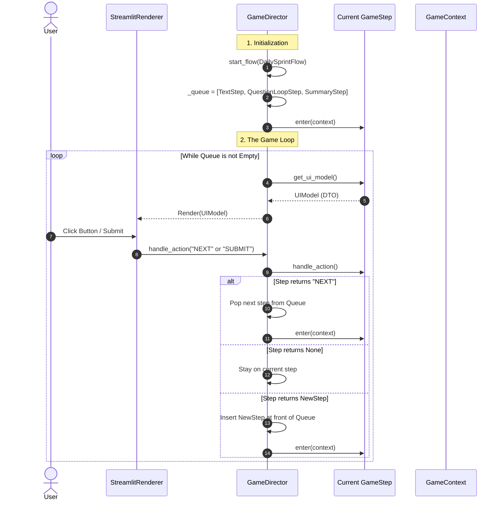
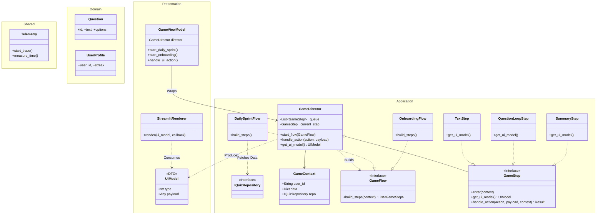

As a commercial-grade developer, here is my assessment of your diagrams based on the refactoring we just completed.

### The Verdict

1.  **The State Diagram:** ❌ **OBSOLETE (Delete/Replace)**.
    *   **Why:** Your application is **no longer a Finite State Machine**. It is now a **Queue Processor**. The old diagram implies hardcoded transitions (e.g., `SPRINT` -> `CHECK_ERRORS`). In the new code, the `GameDirector` doesn't know what "Sprint" or "Correction" means; it just pops the next `GameStep` from a list.
    *   **Action:** Replace this with a **Sequence Diagram** showing how the Director processes a generic queue.

2.  **The Class Diagram:** ✅ **EXCELLENT (Keep & Polish)**.
    *   **Why:** This diagram accurately represents the new "Game Engine" architecture. It correctly shows the relationships between the Director, Flows, and Steps.
    *   **Action:** Keep it, but update a few names to match the final code exactly (e.g., `ViewRenderer` -> `StreamlitRenderer`).

---

### 1. The Replacement for the State Diagram
Since the global state machine is gone, we should document **The Director's Loop**. This explains how the engine moves through *any* flow.

**Update your documentation with this Sequence Diagram:**

---

### 2. The Polished Class Diagram
This is the "Map of the World" for your new architecture. I have updated it to strictly match the code we wrote (e.g., adding `StreamlitRenderer` and `GameViewModel`).

### Summary
*   **Delete** the old State Diagram. It describes a system that no longer exists.
*   **Add** the Sequence Diagram. It explains *how* the engine works.
*   **Update** the Class Diagram. It explains *what* the engine is made of.

---

Can you elaborate what the differences to our previous implementation (Clean architecture, SOLID, screaming architecture, model, repository, services) from beginning of conversation to current version and when to choose what?

---

This is a profound question that touches on the heart of software architecture: **Context is King.**

Both implementations followed "Clean Architecture" and SOLID principles, but they solved different problems.

Here is the breakdown of the evolution from **Version 1 (Service-Oriented)** to **Version 2 (Game Engine)**, and how to choose between them.

---

### 1. The Comparison

#### Version 1: Service-Oriented Architecture (SOA) + FSM
*   **Structure:** `QuizService`, `QuizRepository`, `QuizStateMachine` (Enum-based).
*   **Mental Model:** "The user is in a specific state (e.g., `QUESTION_ACTIVE`). When they click a button, the Service updates the database, and the FSM transitions to the next state."
*   **Flow Control:** Hardcoded in the FSM transition table (`src/fsm.py`).
*   **Business Logic:** Encapsulated in `QuizService` methods (`submit_answer`, `finalize_session`).

#### Version 2: Game Engine Architecture (Command Pattern + Chain of Responsibility)
*   **Structure:** `GameDirector`, `GameFlow` (Factory), `GameStep` (Command/State).
*   **Mental Model:** "The user is on a journey (Flow). The Director pulls the next screen (Step) from a queue. The Step decides how to handle input and what to show."
*   **Flow Control:** Dynamic. Defined by the list of steps returned by a `GameFlow`.
*   **Business Logic:** Distributed into small, reusable `GameStep` classes (`QuestionLoopStep`, `SummaryStep`).

---

### 2. Key Differences by Principle

| Principle | Version 1 (Service + FSM) | Version 2 (Game Engine) |
| :--- | :--- | :--- |
| **SRP (Single Responsibility)** | **Good.** Service handles logic, Repo handles DB.   *Risk:* Service tends to grow huge ("God Class") as you add more features like Onboarding. | **Excellent.** Each `GameStep` handles logic *only* for that specific screen. `TextStep` knows nothing about scoring. |
| **OCP (Open/Closed)** | **Weak.** To add "Onboarding", you had to modify the `QuizState` enum, the FSM transition table, and the `QuizService`. | **Strong.** To add "Onboarding", you create a new `OnboardingFlow` class. You touch *zero* existing code. |
| **Control Flow** | **Rigid.** The FSM dictates that `FEEDBACK` always follows `QUESTION`. Changing this requires rewriting the FSM. | **Flexible.** You can insert a `StoryStep` between two `QuestionSteps` just by adding it to the list in the Flow. |
| **State Management** | **Centralized.** `QuizSessionState` held everything. | **Contextual.** `GameContext` holds shared data, but individual Steps can hold transient state (e.g., `QuestionLoopStep` tracks its own index). |

---

### 3. When to Choose What?

#### Choose Version 1 (Service + FSM) When:
*   **The process is linear and static.** (e.g., A standard CRUD form wizard: Step 1 -> Step 2 -> Step 3 -> Save).
*   **The rules are global.** (e.g., "Every time a user submits an order, we must email the admin"). A Service is a great place for this central logic.
*   **You are building a standard Web App.** Most E-commerce or SaaS apps fit this model perfectly.
*   **Simplicity is priority.** A Service is easier to understand for a junior dev than a Director/Queue system.

#### Choose Version 2 (Game Engine / Workflow Engine) When:
*   **The user journey varies significantly.** (e.g., New users see a tutorial; Returning users see a dashboard; VIP users see a bonus round).
*   **You need "Scripted" sequences.** (e.g., Games, complex onboarding wizards, chatbots).
*   **You need to re-order steps dynamically.** (e.g., "If the user gets this wrong, insert a 'Remedial Lesson' step immediately").
*   **You want to A/B test flows.** (e.g., Flow A has 3 steps, Flow B has 5 steps). In Version 2, this is just two different `GameFlow` classes.

### 4. The "Commercial Grade" Takeaway

**Version 1 was not "wrong".** It was the correct architecture for a simple quiz.
**Version 2 became necessary** when you asked for *Onboarding* and *Bonus Rounds*.

In Version 1, adding Onboarding would have turned your `QuizService` into a mess of `if (mode == ONBOARDING)` statements.
In Version 2, Onboarding is just another class.

**The Lesson:**
Start with **Version 1** (Simple Service).
Refactor to **Version 2** (Engine/Polymorphism) only when the **flow complexity** exceeds the **implementation complexity**. We reached that tipping point when we needed multiple distinct user journeys.
