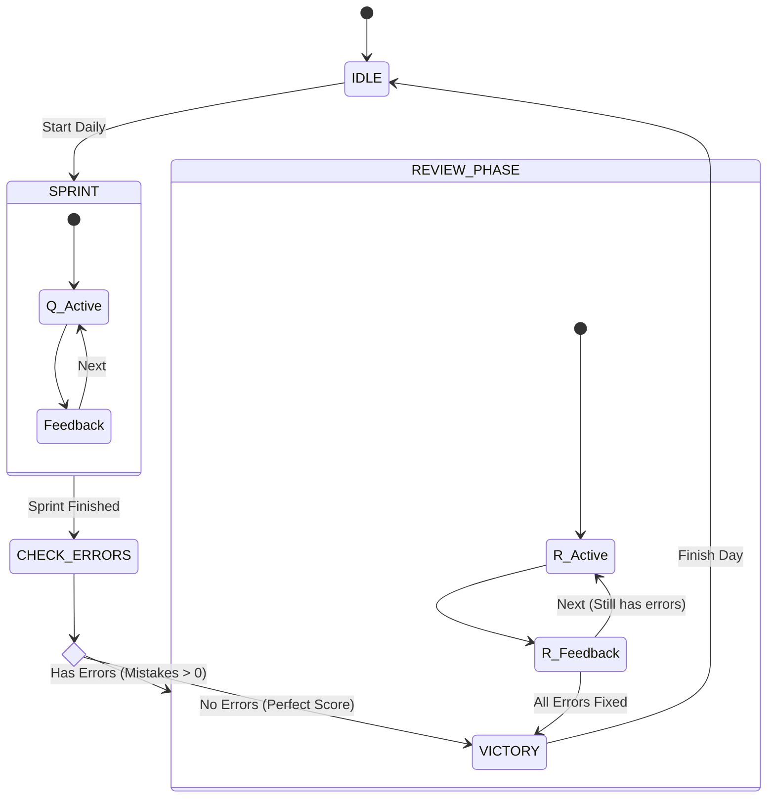
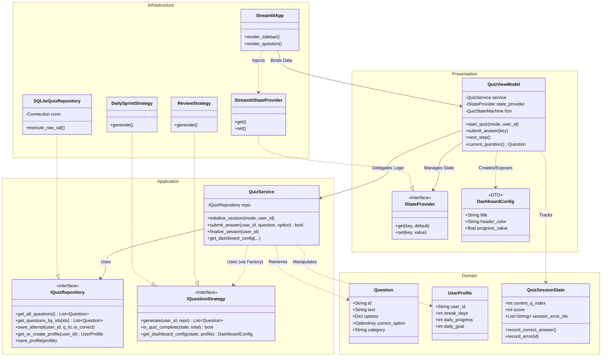

```mermaid
stateDiagram-v2
    [*] --> IDLE
    IDLE --> SPRINT : Start Daily
    
    state SPRINT {
        [*] --> Q_Active
        Q_Active --> Feedback
        Feedback --> Q_Active : Next
    }

    SPRINT --> CHECK_ERRORS : Sprint Finished

    state c1 <<choice>>
    CHECK_ERRORS --> c1
    
    c1 --> REVIEW_PHASE : Has Errors (Mistakes > 0)
    c1 --> VICTORY : No Errors (Perfect Score)

    state REVIEW_PHASE {
        [*] --> R_Active
        R_Active --> R_Feedback
        R_Feedback --> R_Active : Next (Still has errors)
        R_Feedback --> VICTORY : All Errors Fixed
    }

    VICTORY --> IDLE : Finish Day
```

```mermaid
classDiagram
    %% ============================================================
    %% LAYER 1: DOMAIN (Entities & Business Rules)
    %% Pure Python. No dependencies on UI or DB.
    %% ============================================================
    namespace Domain {
        class Question {
            +String id
            +String text
            +Dict options
            +OptionKey correct_option
            +String category
        }

        class UserProfile {
            +String user_id
            +int streak_days
            +int daily_progress
            +int daily_goal
        }

        class QuizSessionState {
            +int current_q_index
            +int score
            +List~String~ session_error_ids
            +record_correct_answer()
            +record_error(id)
        }
    }

    %% ============================================================
    %% LAYER 2: APPLICATION (Use Cases & Contracts)
    %% Orchestrates data flow. Defines Interfaces (Ports).
    %% ============================================================
    namespace Application {
        class IQuizRepository {
            <<Interface>>
            +get_all_questions() List~Question~
            +get_questions_by_ids(ids) List~Question~
            +save_attempt(user_id, q_id, is_correct)
            +get_or_create_profile(user_id) UserProfile
            +save_profile(profile)
        }

        class IQuestionStrategy {
            <<Interface>>
            +generate(user_id, repo) List~Question~
            +is_quiz_complete(state, total) bool
            +get_dashboard_config(state, profile) DashboardConfig
        }

        class QuizService {
            -IQuizRepository repo
            +initialize_session(mode, user_id)
            +submit_answer(user_id, question, option) bool
            +finalize_session(user_id)
            +get_dashboard_config(...)
        }
    }

    %% ============================================================
    %% LAYER 3: PRESENTATION / ADAPTERS
    %% Converts data for the UI.
    %% ============================================================
    namespace Presentation {
        class IStateProvider {
            <<Interface>>
            +get(key, default)
            +set(key, value)
        }

        class QuizViewModel {
            -QuizService service
            -IStateProvider state_provider
            -QuizStateMachine fsm
            +start_quiz(mode, user_id)
            +submit_answer(key)
            +next_step()
            +current_question() Question
        }

        class DashboardConfig {
            <<DTO>>
            +String title
            +String header_color
            +float progress_value
        }
    }

    %% ============================================================
    %% LAYER 4: INFRASTRUCTURE (Frameworks & Drivers)
    %% The dirty details. Points inward.
    %% ============================================================
    namespace Infrastructure {
        class SQLiteQuizRepository {
            -Connection conn
            +execute_raw_sql()
        }

        class StreamlitStateProvider {
            +get()
            +set()
        }

        class DailySprintStrategy {
            +generate()
        }

        class ReviewStrategy {
            +generate()
        }
        
        class StreamlitApp {
            +render_sidebar()
            +render_question()
        }
    }

    %% ============================================================
    %% RELATIONSHIPS
    %% ============================================================

    %% Realization (Implements Interface)
    SQLiteQuizRepository ..|> IQuizRepository
    StreamlitStateProvider ..|> IStateProvider
    DailySprintStrategy ..|> IQuestionStrategy
    ReviewStrategy ..|> IQuestionStrategy

    %% Composition / Association
    QuizService --> IQuizRepository : Uses
    QuizService ..> IQuestionStrategy : Uses (via Factory)
    
    QuizViewModel --> QuizService : Delegates Logic
    QuizViewModel --> IStateProvider : Manages State
    QuizViewModel ..> DashboardConfig : Creates/Exposes

    StreamlitApp --> QuizViewModel : Binds Data
    StreamlitApp ..> StreamlitStateProvider : Injects

    %% Domain Usage
    QuizService ..> UserProfile : Manipulates
    QuizService ..> Question : Retrieves
    QuizViewModel ..> QuizSessionState : Tracks
```