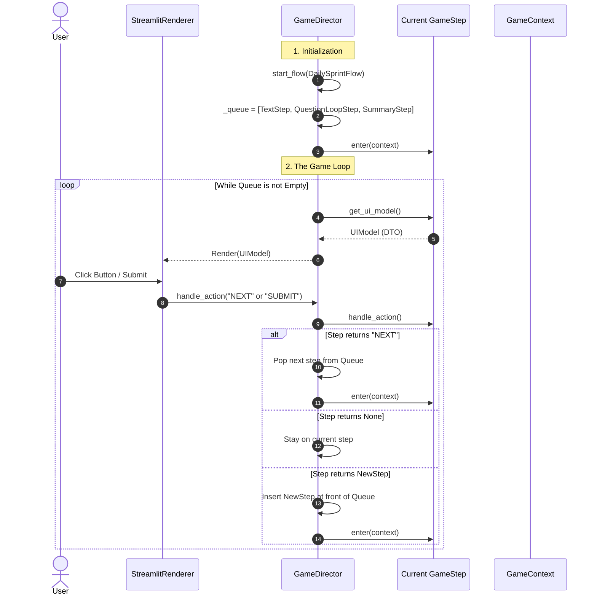
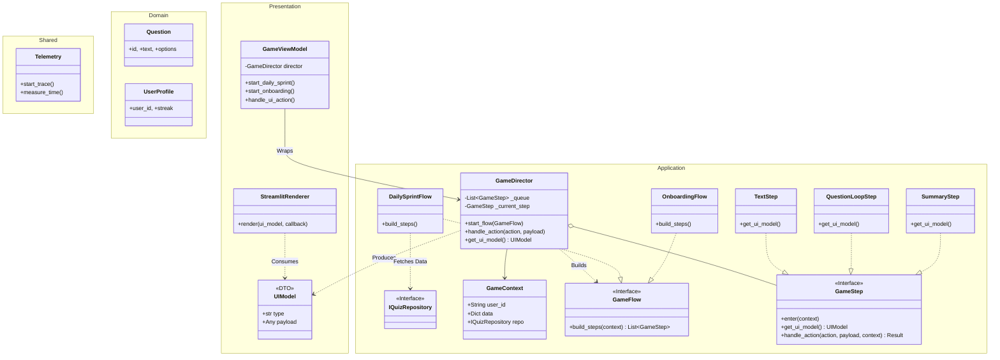

```mermaid
sequenceDiagram
    autonumber
    actor User
    participant View as StreamlitRenderer
    participant Director as GameDirector
    participant Step as Current GameStep
    participant Context as GameContext

    Note over Director: 1. Initialization
    Director->>Director: start_flow(DailySprintFlow)
    Director->>Director: _queue = [TextStep, QuestionLoopStep, SummaryStep]
    Director->>Step: enter(context)

    Note over Director: 2. The Game Loop
    loop While Queue is not Empty
        Director->>Step: get_ui_model()
        Step-->>Director: UIModel (DTO)
        Director-->>View: Render(UIModel)
        
        User->>View: Click Button / Submit
        View->>Director: handle_action("NEXT" or "SUBMIT")
        Director->>Step: handle_action()
        
        alt Step returns "NEXT"
            Director->>Director: Pop next step from Queue
            Director->>Step: enter(context)
        else Step returns None
            Director->>Director: Stay on current step
        else Step returns NewStep
            Director->>Director: Insert NewStep at front of Queue
            Director->>Step: enter(context)
        end
    end
```

```mermaid
classDiagram
    %% ============================================================
    %% SHARED KERNEL
    %% ============================================================
    namespace Shared {
        class Telemetry {
            +start_trace()
            +measure_time()
        }
    }

    %% ============================================================
    %% DOMAIN (Entities)
    %% ============================================================
    namespace Domain {
        class Question { +id, +text, +options }
        class UserProfile { +user_id, +streak }
    }

    %% ============================================================
    %% APPLICATION (Game Engine & Logic)
    %% ============================================================
    namespace Application {
        class IQuizRepository { <<Interface>> }

        %% --- THE NEW ENGINE ---
        class GameContext {
            +String user_id
            +Dict data
            +IQuizRepository repo
        }

        class GameDirector {
            -List~GameStep~ _queue
            -GameStep _current_step
            +start_flow(GameFlow)
            +handle_action(action, payload)
            +get_ui_model() UIModel
        }

        class GameFlow {
            <<Interface>>
            +build_steps(context) List~GameStep~
        }

        class GameStep {
            <<Interface>>
            +enter(context)
            +get_ui_model() UIModel
            +handle_action(action, payload, context) Result
        }

        %% Concrete Flows
        class DailySprintFlow { +build_steps() }
        class OnboardingFlow { +build_steps() }

        %% Concrete Steps
        class TextStep { +get_ui_model() }
        class QuestionLoopStep { +get_ui_model() }
        class SummaryStep { +get_ui_model() }
    }

    %% ============================================================
    %% PRESENTATION (UI)
    %% ============================================================
    namespace Presentation {
        class GameViewModel {
            -GameDirector director
            +start_daily_sprint()
            +start_onboarding()
            +handle_ui_action()
        }
        
        class StreamlitRenderer {
            +render(ui_model, callback)
        }
        
        class UIModel {
            <<DTO>>
            +str type
            +Any payload
        }
    }

    %% ============================================================
    %% RELATIONSHIPS
    %% ============================================================
    
    GameDirector --> GameContext
    GameDirector o-- GameStep
    GameDirector ..> GameFlow : Builds
    GameDirector ..> UIModel : Produces
    
    DailySprintFlow ..|> GameFlow
    OnboardingFlow ..|> GameFlow
    
    TextStep ..|> GameStep
    QuestionLoopStep ..|> GameStep
    SummaryStep ..|> GameStep
    
    GameViewModel --> GameDirector : Wraps
    StreamlitRenderer ..> UIModel : Consumes
    
    DailySprintFlow ..> IQuizRepository : Fetches Data
```