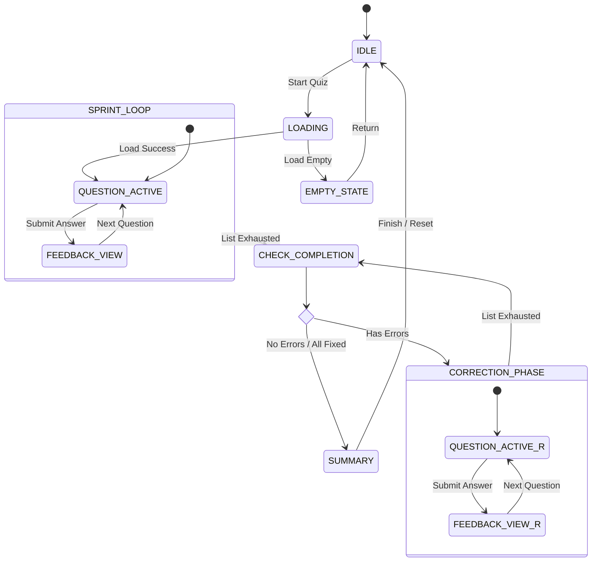
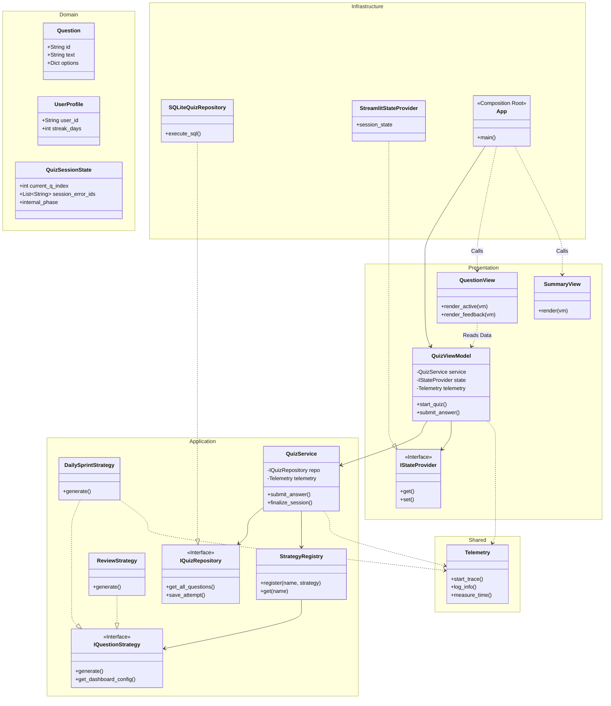

```mermaid
stateDiagram-v2
    [*] --> IDLE
    IDLE --> LOADING : Start Quiz
    LOADING --> QUESTION_ACTIVE : Load Success
    LOADING --> EMPTY_STATE : Load Empty

    state SPRINT_LOOP {
        [*] --> QUESTION_ACTIVE
        QUESTION_ACTIVE --> FEEDBACK_VIEW : Submit Answer
        FEEDBACK_VIEW --> QUESTION_ACTIVE : Next Question
    }

    SPRINT_LOOP --> CHECK_COMPLETION : List Exhausted

    state c1 <<choice>>
    CHECK_COMPLETION --> c1
    
    c1 --> CORRECTION_PHASE : Has Errors
    c1 --> SUMMARY : No Errors / All Fixed

    state CORRECTION_PHASE {
        [*] --> QUESTION_ACTIVE_R
        QUESTION_ACTIVE_R --> FEEDBACK_VIEW_R : Submit Answer
        FEEDBACK_VIEW_R --> QUESTION_ACTIVE_R : Next Question
    }
    
    CORRECTION_PHASE --> CHECK_COMPLETION : List Exhausted

    SUMMARY --> IDLE : Finish / Reset
    EMPTY_STATE --> IDLE : Return
```

```mermaid
classDiagram
    %% ============================================================
    %% SHARED KERNEL (Cross-Cutting)
    %% ============================================================
    namespace Shared {
        class Telemetry {
            +start_trace()
            +log_info()
            +measure_time()
        }
    }

    %% ============================================================
    %% LAYER 1: DOMAIN (Entities)
    %% ============================================================
    namespace Domain {
        class Question {
            +String id
            +String text
            +Dict options
        }
        class UserProfile {
            +String user_id
            +int streak_days
        }
        class QuizSessionState {
            +int current_q_index
            +List~String~ session_error_ids
            +internal_phase
        }
    }

    %% ============================================================
    %% LAYER 2: APPLICATION (Business Logic)
    %% ============================================================
    namespace Application {
        class IQuizRepository {
            <<Interface>>
            +get_all_questions()
            +save_attempt()
        }

        class IQuestionStrategy {
            <<Interface>>
            +generate()
            +get_dashboard_config()
        }

        class DailySprintStrategy {
            +generate()
        }
        class ReviewStrategy {
            +generate()
        }

        class StrategyRegistry {
            +register(name, strategy)
            +get(name)
        }

        class QuizService {
            -IQuizRepository repo
            -Telemetry telemetry
            +submit_answer()
            +finalize_session()
        }
    }

    %% ============================================================
    %% LAYER 3: PRESENTATION (UI Logic & Views)
    %% ============================================================
    namespace Presentation {
        class IStateProvider {
            <<Interface>>
            +get()
            +set()
        }

        class QuizViewModel {
            -QuizService service
            -IStateProvider state
            -Telemetry telemetry
            +start_quiz()
            +submit_answer()
        }

        class QuestionView {
            +render_active(vm)
            +render_feedback(vm)
        }
        class SummaryView {
            +render(vm)
        }
    }

    %% ============================================================
    %% LAYER 4: INFRASTRUCTURE (Frameworks)
    %% ============================================================
    namespace Infrastructure {
        class SQLiteQuizRepository {
            +execute_sql()
        }
        class StreamlitStateProvider {
            +session_state
        }
        class App {
            <<Composition Root>>
            +main()
        }
    }

    %% ============================================================
    %% RELATIONSHIPS
    %% ============================================================

    %% Realization
    SQLiteQuizRepository ..|> IQuizRepository
    StreamlitStateProvider ..|> IStateProvider
    DailySprintStrategy ..|> IQuestionStrategy
    ReviewStrategy ..|> IQuestionStrategy

    %% Application Wiring
    QuizService --> IQuizRepository
    QuizService --> StrategyRegistry
    StrategyRegistry --> IQuestionStrategy
    
    %% Presentation Wiring
    QuizViewModel --> QuizService
    QuizViewModel --> IStateProvider
    
    %% View Delegation
    App --> QuizViewModel
    App ..> QuestionView : Calls
    App ..> SummaryView : Calls
    QuestionView ..> QuizViewModel : Reads Data
    
    %% Telemetry Usage
    QuizService ..> Telemetry
    QuizViewModel ..> Telemetry
    DailySprintStrategy ..> Telemetry
```