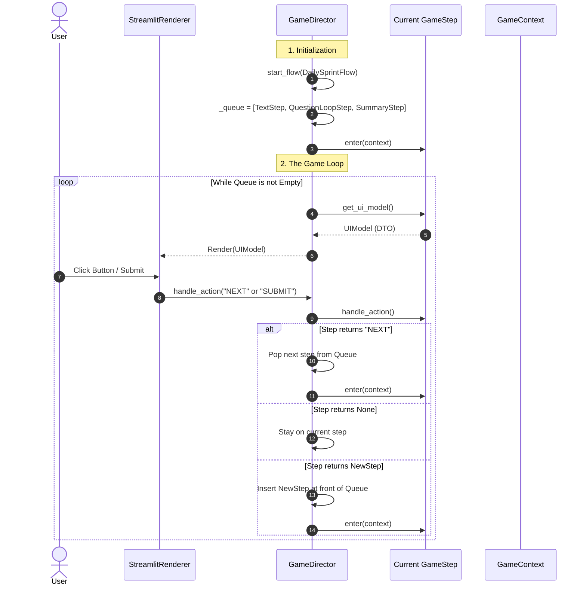

```mermaid
sequenceDiagram
    autonumber
    actor User
    participant View as StreamlitRenderer
    participant Director as GameDirector
    participant Step as Current GameStep
    participant Context as GameContext

    Note over Director: 1. Initialization
    Director->>Director: start_flow(DailySprintFlow)
    Director->>Director: _queue = [TextStep, QuestionLoopStep, SummaryStep]
    Director->>Step: enter(context)

    Note over Director: 2. The Game Loop
    loop While Queue is not Empty
        Director->>Step: get_ui_model()
        Step-->>Director: UIModel (DTO)
        Director-->>View: Render(UIModel)
        
        User->>View: Click Button / Submit
        View->>Director: handle_action("NEXT" or "SUBMIT")
        Director->>Step: handle_action()
        
        alt Step returns "NEXT"
            Director->>Director: Pop next step from Queue
            Director->>Step: enter(context)
        else Step returns None
            Director->>Director: Stay on current step
        else Step returns NewStep
            Director->>Director: Insert NewStep at front of Queue
            Director->>Step: enter(context)
        end
    end
```

```mermaid
classDiagram
    %% ============================================================
    %% SHARED KERNEL
    %% ============================================================
    namespace Shared {
        class Telemetry {
            +start_trace()
            +log_info()
            +log_error()
        }
        class measure_time {
            <<Decorator>>
        }
    }

    %% ============================================================
    %% DOMAIN (Entities)
    %% ============================================================
    namespace Domain {
        class Question {
            +id
            +text
            +options
            +correct_option
        }
        class UserProfile {
            +user_id
            +streak_days
            +daily_progress
            +is_bonus_mode()
        }
        class OptionKey {
            <<Enum>>
            A, B, C, D
        }
    }

    %% ============================================================
    %% GAME ENGINE (Application Layer)
    %% ============================================================
    namespace GameEngine {
        class GameContext {
            +user_id
            +repo : IQuizRepository
            +data : Dict
        }

        class UIModel {
            <<DTO>>
            +type : str
            +payload : Any
        }

        class GameDirector {
            -context : GameContext
            -queue : List~GameStep~
            -current_step : GameStep
            +start_flow(flow)
            +handle_action(action, payload)
            +get_ui_model() UIModel
        }

        class GameFlow {
            <<Abstract>>
            +build_steps(context) List~GameStep~
        }

        class GameStep {
            <<Abstract>>
            +enter(context)
            +get_ui_model() UIModel
            +handle_action(action, payload, context)
        }

        %% Concrete Flows
        class DailySprintFlow {
            +build_steps()
        }
        class OnboardingFlow {
            +build_steps()
        }

        %% Concrete Steps
        class TextStep {
            +payload : TextStepPayload
        }
        class QuestionLoopStep {
            +questions : List~Question~
        }
        class SummaryStep {
            +payload : SummaryPayload
        }
    }

    %% ============================================================
    %% ADAPTERS (Infrastructure)
    %% ============================================================
    namespace Adapters {
        class IQuizRepository {
            <<Interface>>
            +get_all_questions()
            +save_attempt()
            +get_or_create_profile()
        }

        class SQLiteQuizRepository {
            -db_path
            +get_all_questions()
            +save_attempt()
        }
    }

    %% ============================================================
    %% PRESENTATION (UI)
    %% ============================================================
    namespace Presentation {
        class GameViewModel {
            -director : GameDirector
            +ui_model()
            +start_daily_sprint()
            +start_onboarding()
            +handle_ui_action()
        }

        class StreamlitRenderer {
            +render(ui_model, callback)
            -_render_text_step()
        }

        class ViewComponents {
            <<Module>>
            +render_sidebar()
            +apply_styles()
        }

        class QuestionView {
            <<Module>>
            +render_active()
            +render_feedback()
        }

        class SummaryView {
            <<Module>>
            +render()
        }
    }

    %% ============================================================
    %% RELATIONSHIPS
    %% ============================================================

    %% Inheritance
    SQLiteQuizRepository ..|> IQuizRepository
    DailySprintFlow --|> GameFlow
    OnboardingFlow --|> GameFlow
    TextStep --|> GameStep
    QuestionLoopStep --|> GameStep
    SummaryStep --|> GameStep

    %% Composition & Usage
    GameDirector *-- GameContext
    GameDirector o-- GameStep
    GameDirector ..> GameFlow : Uses
    GameDirector ..> UIModel : Produces

    GameViewModel --> GameDirector : Wraps
    StreamlitRenderer ..> UIModel : Consumes
    
    %% View Delegation
    StreamlitRenderer ..> QuestionView : Calls
    StreamlitRenderer ..> SummaryView : Calls
    
    %% Data Access
    GameContext --> IQuizRepository
```