System Startup & Data Seeding
This process happens automatically when the app starts. It ensures the database is ready and populated with your 250 questions.

```mermaid
sequenceDiagram
    participant App as 🖥️ Streamlit UI
    participant Service as ⚙️ QuizService
    participant Repo as 🗄️ Repository
    participant DB as 💾 SQLite DB
    participant File as 📄 JSON File

    Note over App, DB: Application Startup
    App->>Service: get_service() (Cached)
    Service->>Repo: Initialize Repository
    Repo->>DB: CREATE TABLE IF NOT EXISTS
    
    App->>Service: initialize_db_from_file("seed.json")
    Service->>File: Load JSON Data
    File-->>Service: Return List[Question]
    Service->>Repo: seed_questions(List[Question])
    
    loop For each Question
        Repo->>DB: INSERT OR REPLACE INTO questions
    end
    
    DB-->>Repo: Success
    Repo-->>Service: Success
    Service-->>App: Ready
```

---

2. The Learning Flow (Standard Quiz)
This represents Use Case 1. It shows how a user interacts with the UI, how the answer is processed, and how persistence is handled immediately.

---
3. The Repeating Flow (Smart Review)
This represents Use Case 2. It visualizes how the system filters data to help the user learn from mistakes.

### 4. Mermaid Sequence Diagram

This diagram now visualizes the decision logic inside the `seed_questions` method.

```mermaid
sequenceDiagram
    participant App as 🖥️ App Startup
    participant Repo as 🗄️ Repository
    participant DB as 💾 SQLite DB
    
    App->>Repo: seed_questions(New_List)
    Repo->>DB: SELECT * FROM questions
    DB-->>Repo: Return Existing_Map {id: Question}
    
    loop For Each New Question (NewQ)
        Repo->>Repo: Lookup OldQ = Existing_Map.get(NewQ.id)
        
        alt OldQ exists AND Answer Key Changed
            Note right of Repo: CRITICAL CHANGE DETECTED
            Repo->>DB: DELETE FROM user_progress WHERE question_id = NewQ.id
            Note right of DB: User history wiped for this Q
        end
        
        Repo->>DB: INSERT OR REPLACE INTO questions ...
    end
    
    DB-->>Repo: Commit Transaction
    Repo-->>App: Ready
```

