System Startup & Data Seeding
This flow runs immediately when `get_service()` is called. It handles database initialization and the "Smart Seed" logic to ensure data integrity.

---

### 2. The Learning Flow (Standard Quiz)
Reflects **Use Case 1**. Note the translation from "Nauka" to "Standard".

```mermaid
sequenceDiagram
    actor User as 👤 Learner
    participant App as 🖥️ Streamlit UI
    participant Service as ⚙️ QuizService
    participant Repo as 🗄️ Repository
    participant DB as 💾 SQLite DB

    Note over User, DB: Mode: Nauka (Standard)
    
    User->>App: Selects "Nauka" & "Daniel"
    
    Note right of App: Translation Layer
    App->>App: MODE_MAPPING["Nauka"] -> "Standard"
    
    App->>Service: get_quiz_questions("Standard", "Daniel")
    Service->>Repo: get_all_questions()
    Repo->>DB: SELECT * FROM questions
    DB-->>Repo: Return JSON Data
    Repo-->>Service: Return List[Question]
    Service-->>App: Return Full Question List

    App->>User: Display Question Q184 + Options

    User->>App: Clicks Answer Button "B"
    Note right of User: Triggers handle_answer() callback
    
    App->>Service: submit_answer("Daniel", Q184, "B")
    
    rect rgb(240, 255, 240)
        Note right of Service: Validation
        Service->>Service: Check if "B" == correct_option
    end

    Service->>Repo: save_attempt("Daniel", Q184, is_correct=True)
    Repo->>DB: UPSERT into user_progress
    
    Service-->>App: Return True (Correct)
    
    App->>User: Show "✅ Dobrze!" Feedback
    App->>User: Show "Następne ➡️" Button
```

---

### 3. The Repeating Flow (Smart Review)
Reflects **Use Case 2**. Note the translation from "Powtórka" and the filtering logic.

```mermaid
sequenceDiagram
    actor User as 👤 Learner
    participant App as 🖥️ Streamlit UI
    participant Service as ⚙️ QuizService
    participant Repo as 🗄️ Repository
    participant DB as 💾 SQLite DB

    Note over User, DB: Mode: Powtórka (Review)

    User->>App: Selects "Powtórka"
    
    Note right of App: Translation Layer
    App->>App: MODE_MAPPING["Powtórka"] -> "Review (Struggling Only)"
    
    App->>Service: get_quiz_questions("Review...", "Daniel")
    
    rect rgb(255, 240, 240)
        Note right of Service: Filtering Logic
        Service->>Repo: get_all_questions()
        Repo-->>Service: [Q1...Q250]
        
        Service->>Repo: get_incorrect_question_ids("Daniel")
        Repo->>DB: SELECT question_id FROM user_progress WHERE is_correct=0
        DB-->>Repo: Return ["184", "205"]
        
        Service->>Service: Filter List -> Only [Q184, Q205]
    end
    
    Service-->>App: Return Filtered List
    
    App->>User: Display Q184 (Struggling Question)
    
    User->>App: Clicks Correct Answer
    App->>Service: submit_answer("Daniel", Q184, Correct)
    Service->>Repo: save_attempt("Daniel", Q184, True)
    Repo->>DB: UPDATE user_progress SET is_correct=1
    
    Note over DB: Q184 is now 'Correct'.<br/>Removed from next Review.
    
    Service-->>App: Return Success
    App->>User: Show Feedback
```

---

### 4. Mode Switching & State Reset
This visualizes the critical bug fix using the `on_change` callback.

```mermaid
sequenceDiagram
    actor User
    participant UI as 🖥️ Streamlit UI
    participant State as 🧠 Session State
    participant Service as ⚙️ QuizService

    Note over User, UI: User is in "Nauka" Mode

    User->>UI: Clicks Radio Button: "Powtórka"
    
    Note right of UI: ⚡ Trigger on_change=reset_quiz_state
    
    UI->>State: reset_quiz_state()
    State-->>State: quiz_questions = []
    State-->>State: current_index = 0
    State-->>State: score = 0
    
    Note right of UI: 🔄 Streamlit Reruns Script
    
    UI->>State: Check if quiz_questions is empty?
    State-->>UI: Yes (Empty)
    
    Note right of UI: Auto-Start Logic
    UI->>UI: Translate "Powtórka" -> "Review..."
    UI->>Service: get_quiz_questions("Review...", "Daniel")
    Service-->>UI: Return [Struggling Questions]
    
    UI->>State: quiz_questions = [Struggling Questions]
    
    UI->>User: Render First Struggling Question
```

