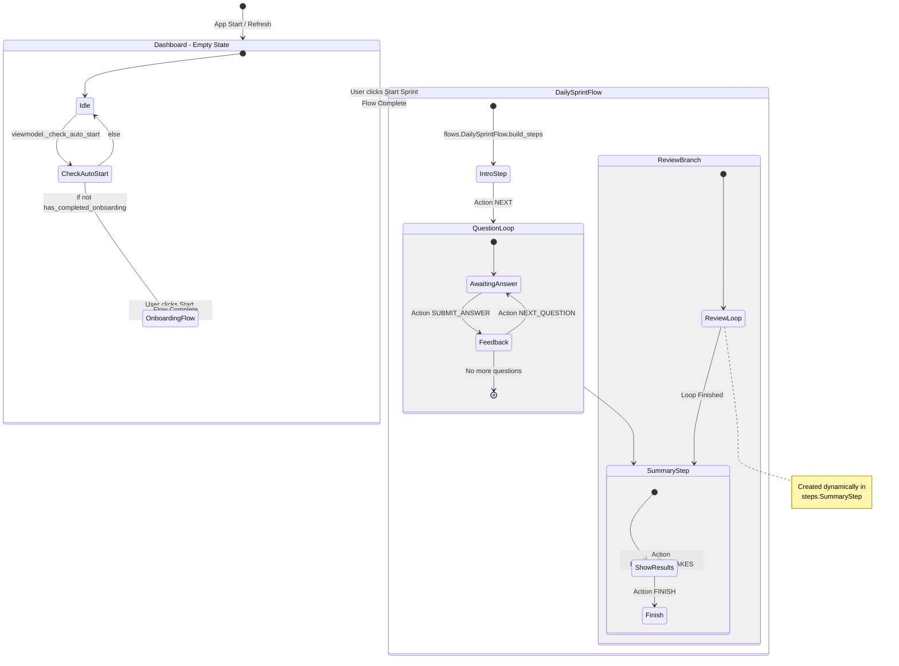
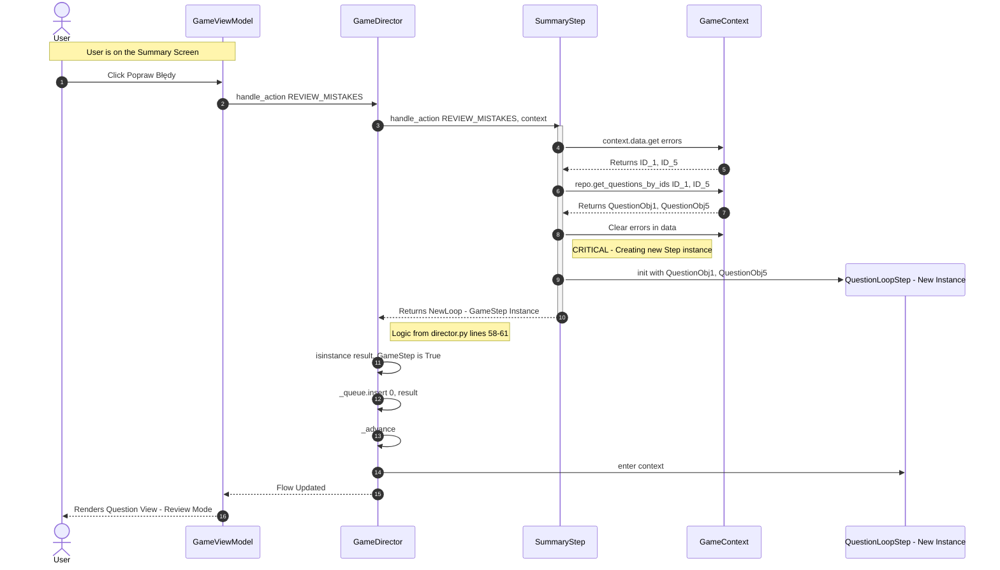
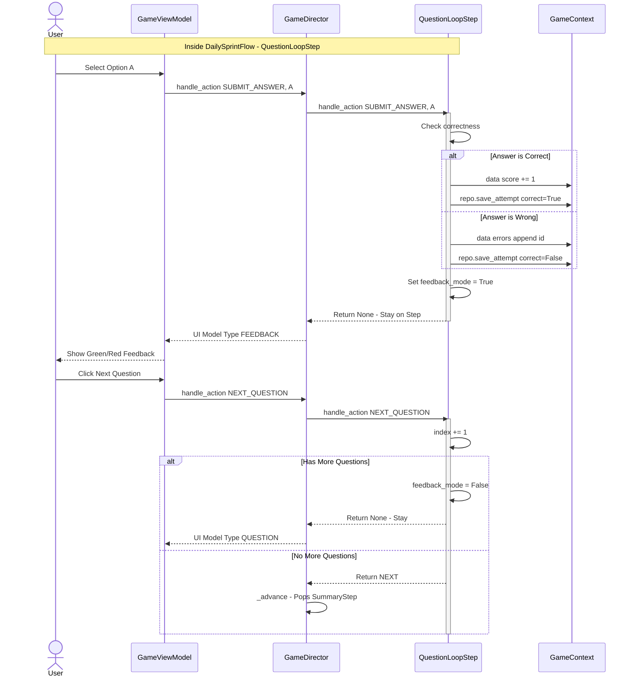

Based on the four files provided (`viewmodel.py`, `flows.py`, `director.py`, `steps.py`), here are the detailed Mermaid diagrams capturing the architecture and user flows.

### 1. High-Level State Machine (User Navigation)
This diagram represents the **GameDirector's** state transitions as controlled by `viewmodel.py` and `flows.py`. It shows how the app moves from the Dashboard into specific flows and how the "Review Mistakes" branch loops back.

### 2. Sequence Diagram: The "Review Mistakes" Dynamic Branching
This diagram focuses specifically on the logic found in `steps.py` (SummaryStep) and `director.py` (handle_action), illustrating how a new step is injected into the running queue.

### 3. Sequence Diagram: Standard Gameplay Loop
This captures the interaction in `QuestionLoopStep` (`steps.py`) and how it communicates with the `Director` and `Context`.

### Key Architectural Patterns Highlighted
1.  **The Trigger (`viewmodel.py`):** The ViewModel is the only entry point for the UI. It decides whether to start a flow (`start_daily_sprint`) or pass an action to the engine.
2.  **The Engine (`director.py`):** It is agnostic of *what* step is running. It just handles the queue. The `isinstance(result, GameStep)` check is the key enabler for dynamic flows.
3.  **The Logic (`steps.py`):** The steps are self-contained. `QuestionLoopStep` manages its own index and feedback state. `SummaryStep` has the intelligence to query the Context and generate a new Step object.