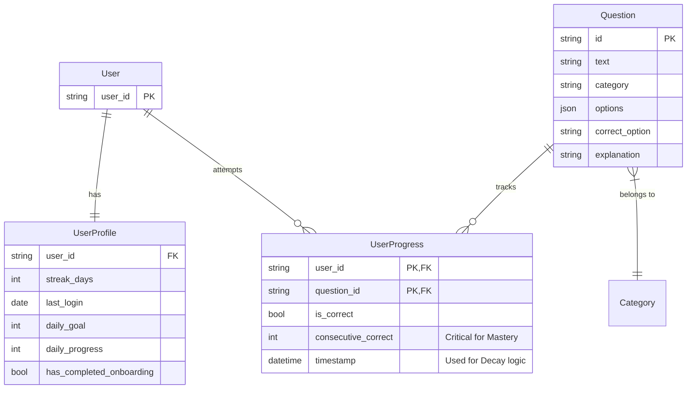
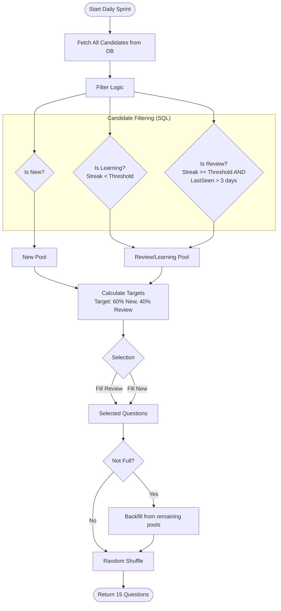
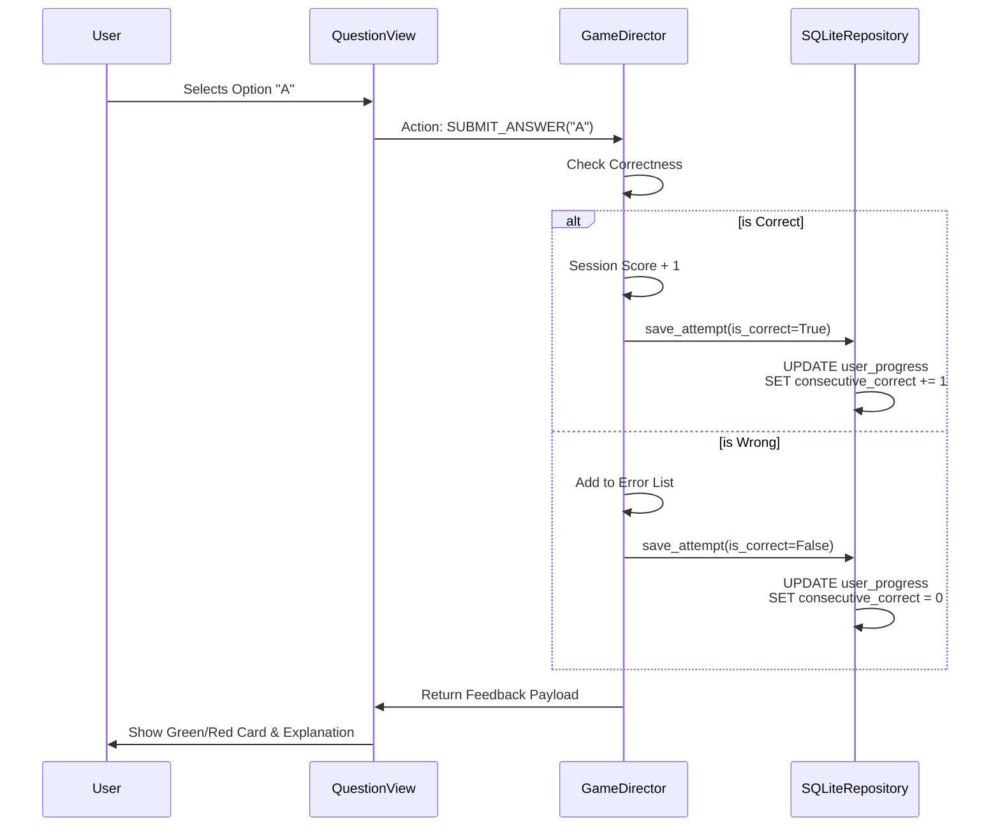
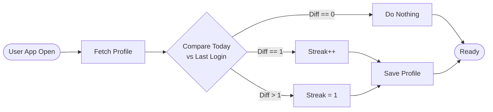
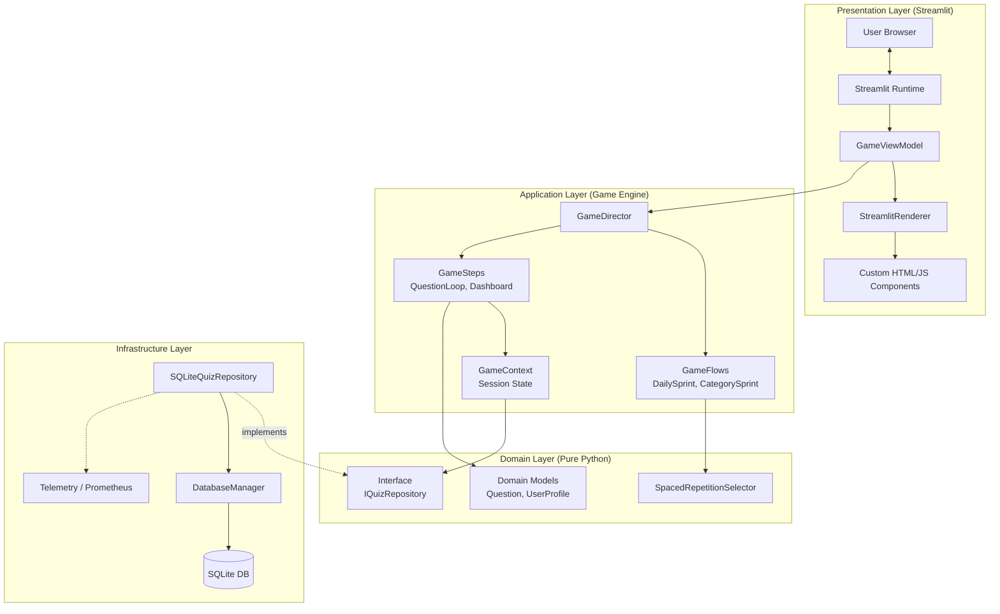
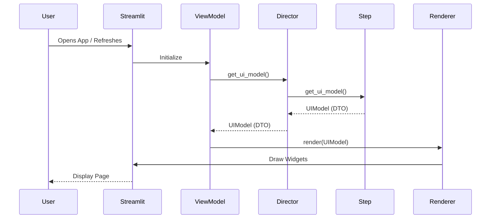
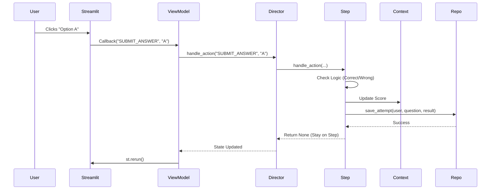

## 1. Domain Understanding

**Context:**
The application is an adaptive learning platform designed to prepare warehouse staff (specifically forklift operators) for technical certification exams (UDT). Unlike a static quiz, the system employs **Spaced Repetition** to optimize retention.

**Core Value Proposition:**
1.  **Efficiency:** Users do not waste time answering questions they already know perfectly.
2.  **Retention:** The system re-introduces "mastered" questions after a decay period to ensure long-term memory.
3.  **Habit Formation:** Gamification elements (Streaks, Daily Goals) encourage small, daily learning sessions rather than "cramming."

**Target Audience:**
Mobile-first users (warehouse operators) who need quick, 3-5 minute training sessions during breaks.

---

## 2. Domain Glossary (Ubiquitous Language)

These terms represent the shared language between the code (Domain Layer) and the business logic.

| Term | Definition | Code Reference |
| :--- | :--- | :--- |
| **Sprint** | A single game session consisting of a fixed number of questions (default: 15). Can be a "Daily Sprint" (mixed) or "Category Sprint" (focused). | `GameConfig.SPRINT_QUESTIONS` |
| **Mastery** | The state of a question where the user has answered it correctly `N` times in a row. Currently, $N=1$. | `GameConfig.MASTERY_THRESHOLD` |
| **Streak (User)** | The number of consecutive days a user has logged in. Resets if a day is skipped. | `UserProfile.streak_days` |
| **Streak (Question)** | The number of times a specific question has been answered correctly *in a row*. Resets to 0 immediately upon a wrong answer. | `user_progress.consecutive_correct` |
| **Candidate** | A question eligible to be included in a Sprint. It carries metadata about the user's history with it (seen/unseen, current streak). | `QuestionCandidate` |
| **Smart Mix** | The algorithmically generated set of questions for a Daily Sprint. It balances **New** material vs. **Review** material. | `SpacedRepetitionSelector` |
| **Decay** | The logic that forces a "Mastered" question back into the review pool if it hasn't been seen in a specific timeframe (3 days). | `sqlite_repository.py` (SQL Query) |
| **Onboarding** | A one-time flow that initializes the user profile and teaches UI mechanics. | `OnboardingFlow` |

---

## 3. Business Rules and Constraints

### 3.1. Learning Algorithm (Spaced Repetition)
The "Smart Mix" algorithm selects questions based on the following priority hierarchy:
1.  **Pool Segregation:**
    *   **New Pool:** Questions never seen by the user.
    *   **Learning Pool:** Seen questions with `question_streak < MASTERY_THRESHOLD`.
    *   **Review Pool:** Seen questions with `question_streak >= MASTERY_THRESHOLD`.
2.  **Selection Ratio:** The system attempts to fill **60%** of the Sprint with **New** questions (`GameConfig.NEW_RATIO = 0.6`).
3.  **Review Trigger:** A Mastered question re-enters the candidate pool if:
    *   It was last answered > 3 days ago.
4.  **Backfill Strategy:** If there aren't enough "New" questions, the system fills the remaining slots with "Learning/Review" questions to ensure the user always has a full Sprint.

### 3.2. Gamification & Progression
*   **Daily Goal:** The user targets **3** completed sprints per day.
*   **Streak Calculation:**
    *   Login on $Today = LastLogin$: No change.
    *   Login on $Today = LastLogin + 1$: Streak increments (+1).
    *   Login on $Today > LastLogin + 1$: Streak resets to 1.
*   **Passing Score:** A Sprint is considered "Passed" (Positive Rating) if the score is $\ge 11/15$ (~73%).

### 3.3. Question Logic
*   **Immediate Feedback:** The user must see if they were correct/incorrect immediately after submission.
*   **High Stakes Reset:** If a user answers a question incorrectly, their `consecutive_correct` count for that question resets to **0**, regardless of how high it was previously.

---

## 4. Domain Model (Entity Relationships)

This diagram represents the logical data structure derived from `src/quiz/domain/models.py` and the SQLite schema.

---

## 5. Core Business Processes

### 5.1. The "Smart Mix" Generation Process
This is the most complex logic in the system, residing in `SpacedRepetitionSelector`.

### 5.2. User Attempt & Mastery Update
This process describes what happens when a user clicks an answer button.

### 5.3. Profile Synchronization (Login)
Logic found in `get_or_create_profile` to handle streaks.

Here is the **Architecture Overview** documentation package.

This document outlines the structural design of the Warehouse Quiz App. It highlights the transition from a standard script-based Streamlit app to a commercial-grade **Hexagonal Architecture** driven by a **State Machine**.

---

## 1. System Architecture Diagram

The system follows a strict **Layered Hexagonal Architecture** (Ports and Adapters). This ensures that the core business logic (Spaced Repetition, Scoring) is completely isolated from the UI framework (Streamlit) and the Database (SQLite).

---

## 2. Component Interaction Patterns

### 2.1. The Passive View Pattern
Streamlit reruns the entire script on every interaction. To prevent logic from resetting or becoming "spaghetti code," we use the **Passive View** pattern.
*   **The Renderer (`src/quiz/presentation/renderer.py`)** is "dumb." It contains no logic. It accepts a `UIModel` (DTO) and simply draws widgets.
*   **The Director (`src/game/director.py`)** calculates the state.
*   **Benefit:** We can unit test the game logic without spinning up a browser.

### 2.2. The State Machine (Game Director)
The application behaves as a finite state machine managed by the `GameDirector`.
*   **Flows:** Factories that define a sequence of states (e.g., `DailySprintFlow` creates `[QuestionLoopStep, SummaryStep]`).
*   **Steps:** Individual states that handle user input (`handle_action`) and define output (`get_ui_model`).
*   **Queue:** The Director manages a queue of steps. When a step returns `"NEXT"`, the Director pops the next step from the queue.

### 2.3. Repository Pattern (Ports & Adapters)
The Domain layer defines *what* it needs (`IQuizRepository`), but not *how* to get it.
*   **Port:** `src/quiz/domain/ports.py`
*   **Adapter:** `src/quiz/adapters/sqlite_repository.py`
*   **Benefit:** Allows swapping SQLite for PostgreSQL or a Mock for testing without changing a single line of the Game Engine.

---

## 3. Technology Stack Decisions & Rationale

| Component | Technology | Rationale |
| :--- | :--- | :--- |
| **Language** | **Python 3.12+** | Leverages modern typing features (`type | None`, `ParamSpec`) for strict static analysis and performance improvements. |
| **Frontend** | **Streamlit** | Enables rapid development of data-heavy UI. We mitigate its "rerun" limitations using the State Machine architecture. |
| **UI Components** | **HTML/JS/CSS** | Custom `st.components.v2` are used for the Mobile Header and Dashboard to bypass Streamlit's styling limitations and provide a native-app feel. |
| **Database** | **SQLite (WAL Mode)** | Zero-configuration, file-based persistence ideal for embedded/single-instance apps. WAL (Write-Ahead Logging) mode is enabled for better concurrency. |
| **Observability** | **Prometheus & OpenTelemetry** | "Commercial Grade" requirement. Provides real-time metrics (latency, error rates) and distributed tracing capabilities via `src/shared/telemetry.py`. |
| **Quality Assurance** | **Ruff, Mypy, Pytest** | Strict linting and static type checking ensure the codebase remains maintainable and bug-free as it scales. |

---

## 4. Integration Points

### 4.1. Internal Integration (Persistence)
*   **SQLite File:** The app integrates with the local file system at `data/quiz.db`.
*   **Migration System:** The `DatabaseManager` performs schema checks on startup (`_init_schema`, `_migrate_schema`) to ensure the DB structure matches the code version.

### 4.2. External Integration (Observability)
*   **Prometheus Scraper:** The app exposes metrics (via `prometheus-client`). In a production environment, a Prometheus server would scrape these metrics.
*   **Sentry (Configured):** The `pyproject.toml` includes `sentry-sdk`, indicating integration with Sentry for error tracking and crash reporting.

### 4.3. Future Integration (Authentication)
*   **Current State:** Hardcoded to "User1".
*   **Integration Point:** The `GameContext` initialization in `GameViewModel` is the injection point for an external Identity Provider (OAuth2/OIDC).

---

## 5. Data Flow Diagrams

### 5.1. Rendering Flow (Read Path)
How the system decides what to show the user after a reload.

### 5.2. Action Flow (Write Path)
How the system processes a user answer.

Here is the **Functional Requirements** documentation package.

This document translates the technical implementation into user-centric requirements, categorized by priority and detailed with acceptance criteria.

---

## 3. Functional Requirements

### 3.1. User Stories & Acceptance Criteria

#### **US-01: Daily Learning Sprint**
**As a** Forklift Operator,
**I want** to complete a quick, mixed set of questions every day,
**So that** I can maintain my certification knowledge without spending hours studying.

*   **Acceptance Criteria:**
    1.  The Dashboard displays a prominent "Start Daily Sprint" button.
    2.  The sprint consists of exactly 15 questions (configurable via `SPRINT_QUESTIONS`).
    3.  The question mix follows the "Smart Mix" ratio: ~60% new material, ~40% review material.
    4.  Upon completion, a Summary screen displays the score, percentage, and a Pass/Fail grade (Threshold: 11/15).
    5.  The user cannot skip questions; they must select an answer to proceed.

#### **US-02: Spaced Repetition (Smart Review)**
**As a** Learner,
**I want** the app to bring back questions I learned a few days ago,
**So that** I don't forget them over time.

*   **Acceptance Criteria:**
    1.  Questions marked as "Mastered" (1 correct answer streak) are hidden from the review pool for 3 days.
    2.  After 3 days, "Mastered" questions reappear in the Daily Sprint candidates list.
    3.  If a user answers a "Mastered" question incorrectly, its streak resets to 0 immediately.

#### **US-03: Immediate Feedback**
**As a** User,
**I want** to know immediately if I answered correctly,
**So that** I can learn from my mistakes in the moment.

*   **Acceptance Criteria:**
    1.  When an option is clicked, the UI updates immediately without a full page reload.
    2.  **Correct Answer:** The selected option turns Green.
    3.  **Wrong Answer:** The selected option turns Red, and the correct option is highlighted (dashed border/Green).
    4.  An explanation text box appears below the options explaining *why* the answer is correct.

#### **US-04: Progress Dashboard**
**As a** User,
**I want** to see my mastery progress per category,
**So that** I know which topics (e.g., "BHP", "Hydraulics") need more focus.

*   **Acceptance Criteria:**
    1.  The Dashboard displays a list of all 6 categories defined in `config.py`.
    2.  Each category card shows a progress bar and a percentage (Mastered Questions / Total Questions).
    3.  A "Global Mastery" card at the top shows the overall progress across the entire database.
    4.  The Dashboard estimates the "Finish Date" based on the user's remaining questions and daily velocity.

#### **US-05: Mistake Review**
**As a** Learner,
**I want** to retry the questions I got wrong immediately after a sprint,
**So that** I can fix my knowledge gaps while the context is fresh.

*   **Acceptance Criteria:**
    1.  If the user makes errors during a sprint, the Summary screen displays a "Fix Mistakes" button.
    2.  Clicking this button starts a new, temporary flow containing *only* the questions answered incorrectly.
    3.  If the score was 100%, the "Fix Mistakes" button is hidden.

---

### 3.2. Feature Specifications & Priority

| ID | Feature Name | Description | Priority |
| :--- | :--- | :--- | :--- |
| **F-01** | **Adaptive Engine** | The backend logic (`SpacedRepetitionSelector`) that queries the DB for candidates, filters by timestamp/streak, and shuffles the final deck. | **P0 (Critical)** |
| **F-02** | **Mobile-First UI** | Custom HTML/CSS components (`mobile_header`, `mobile_option`) that override Streamlit defaults to provide large touch targets and a native app feel. | **P0 (Critical)** |
| **F-03** | **Offline Resilience** | The database architecture (`SQLite`) allows the app to run in environments with poor connectivity (if deployed locally/on-premise). | **P1 (High)** |
| **F-04** | **Category Mode** | A manual mode allowing users to select a specific category (e.g., "Law") and run a sprint consisting *only* of questions from that topic. | **P1 (High)** |
| **F-05** | **Onboarding Flow** | A tutorial sequence that runs automatically on the very first login to explain UI mechanics (e.g., "Green means correct"). | **P2 (Medium)** |
| **F-06** | **Telemetry** | Integration with Prometheus/OpenTelemetry to track API latency and error rates for system health monitoring. | **P2 (Medium)** |

---

Here are the core Use Cases for the Warehouse Quiz App, written strictly according to Alistair Cockburn’s methodology.

### Use Case 1: Complete Daily Sprint

**Use Case:** Complete Daily Sprint
**Goal Level:** 🌊 Sea Level (User Goal)
**Scope:** Warehouse Quiz App (System)
**Primary Actor:** Forklift Operator
**Preconditions:**
*   User is logged into the application.
*   User is on the main Dashboard.

**Main Success Scenario:**
1. User initiates the Daily Sprint.
2. System generates a "Smart Mix" of questions (balancing new and review items).
3. System presents the first question with multiple options.
4. User selects an answer option.
5. System validates the answer and displays immediate feedback (correctness and explanation).
6. User requests the next question.
7. *Steps 3-6 repeat until the sprint limit (15 questions) is reached.*
8. System calculates the final score and pass/fail grade.
9. System updates the user's daily streak and mastery statistics.
10. System displays the Session Summary.

**Extensions:**
*2a. User has mastered all available questions:*
    *   2a1. System displays "All Mastered" congratulatory message.
    *   2a2. User acknowledges message.
    *   2a3. System returns to Dashboard.
    *   2a4. Use case ends.
*4a. User selects the correct answer:*
    *   4a1. System highlights the selection in green.
    *   4a2. System increments the session score and question streak.
*4b. User selects an incorrect answer:*
    *   4b1. System highlights the selection in red and indicates the correct option.
    *   4b2. System resets the question streak to zero.
    *   4b3. System adds the question to the "Session Errors" list.
*6a. User navigates away (e.g., Home button) before finishing:*
    *   6a1. System discards partial session progress (score).
    *   6a2. System preserves question-level mastery updates already recorded.
    *   6a3. Use case ends.

**Success Guarantees:**
*   User's daily activity is recorded.
*   Mastery levels for attempted questions are updated in the database.
*   Daily Goal progress is incremented.

---

### Use Case 2: Review Specific Category

**Use Case:** Review Specific Category
**Goal Level:** 🌊 Sea Level (User Goal)
**Scope:** Warehouse Quiz App (System)
**Primary Actor:** Forklift Operator
**Preconditions:** User is on the main Dashboard.

**Main Success Scenario:**
1. User selects a specific category (e.g., "BHP") from the dashboard grid.
2. System retrieves questions belonging exclusively to that category.
3. System presents a question from the category.
4. User selects an answer.
5. System validates and displays feedback.
6. User requests the next question.
7. *Steps 3-6 repeat until the sprint limit is reached.*
8. System displays the Session Summary.

**Extensions:**
*2a. Category contains no questions:*
    *   2a1. System displays "Category Empty" message.
    *   2a2. User acknowledges.
    *   2a3. System returns to Dashboard.
    *   2a4. Use case ends.

**Success Guarantees:**
*   User has practiced questions only from the selected domain.
*   Category-specific mastery statistics are updated.

---

### Use Case 3: Fix Mistakes

**Use Case:** Fix Mistakes
**Goal Level:** 🌊 Sea Level (User Goal)
**Scope:** Warehouse Quiz App (System)
**Primary Actor:** Forklift Operator
**Preconditions:**
*   User has just completed a Sprint (Daily or Category).
*   User answered at least one question incorrectly during that sprint.

**Main Success Scenario:**
1. User selects "Fix Mistakes" from the Summary screen.
2. System retrieves the specific questions failed in the previous session.
3. System presents the first failed question.
4. User selects an answer.
5. System validates and displays feedback.
6. User requests the next question.
7. *Steps 3-6 repeat until all failed questions are re-attempted.*
8. System displays the Session Summary.

**Extensions:**
*4a. User answers incorrectly again:*
    *   4a1. System records the failure (streak remains zero).
    *   4a2. System shows feedback.
    *   4a3. Flow continues to next question (System does not force infinite loop).

**Success Guarantees:**
*   User has re-exposed themselves to the specific knowledge gaps identified in the previous session.

---

### Use Case 4: Onboard New User

**Use Case:** Onboard New User
**Goal Level:** 🌊 Sea Level (User Goal)
**Scope:** Warehouse Quiz App (System)
**Primary Actor:** New User
**Preconditions:** User profile does not exist or is flagged as `has_completed_onboarding = False`.

**Main Success Scenario:**
1. User launches the application.
2. System detects first-time access.
3. System presents the Welcome / Tutorial screen.
4. User proceeds to the training segment.
5. System presents a "Tutorial Question" (guided interaction).
6. User selects the correct answer.
7. System displays the "Training Complete" confirmation.
8. User acknowledges completion.
9. System marks the profile as onboarded.
10. System redirects User to the main Dashboard.

**Extensions:**
*6a. User selects incorrect answer during tutorial:*
    *   6a1. System provides feedback explaining the UI mechanics (Red/Green cards).
    *   6a2. User proceeds (Tutorial allows failure to demonstrate feedback mechanism).

**Success Guarantees:**
*   User profile is initialized in the database.
*   User has seen the core UI interaction pattern.
*   User is granted access to the main Dashboard.
---

### 3.4. Business Logic Descriptions

**1. The Mastery Threshold Rule**
*   **Logic:** A question is considered "Mastered" when `consecutive_correct >= 1`.
*   **Implication:** This is a low threshold designed for rapid initial progress. In future versions, this config (`GameConfig.MASTERY_THRESHOLD`) can be increased to 3 or 5 for higher difficulty without code changes.

**2. The "New Ratio" Algorithm**
*   **Logic:** `target_new = limit * 0.6`.
*   **Behavior:** The system aggressively pushes new content. If the user has 1000 unseen questions, every daily sprint will force 9 of them into the active rotation, preventing the user from getting stuck in an endless review loop of old material.

**3. The Streak Reset Logic**
*   **Logic:** `new_streak = current_streak + 1` IF `(today - last_login) == 1`. ELSE `new_streak = 1`.
*   **Constraint:** The system does not support "Streak Freezes" or weekend skips. Missing a single day resets the gamification counter to 1, enforcing strict daily discipline.
